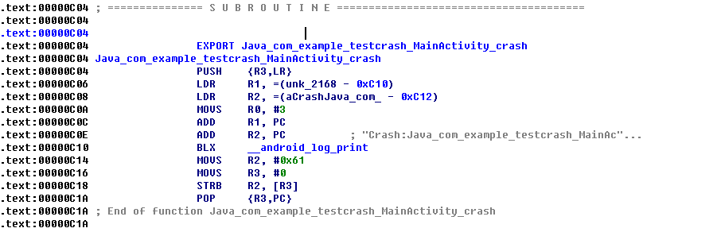

#手边的ARM汇编代码
谈起汇编，首先就是会想到20世纪末的大神（以前都说啥C嵌汇编多效率、汇编跳过验证点做破解啥的鬼神事迹）还有现在的硬件或更好听的嵌入式攻城狮。当年一本王爽的《汇编语言》算是够简明、生动以及全面的宝典了，但是实际工作中用到的却又很少。尤其现在的移动90后年代，大家更多的实践是在Android和iOS也就是ARM平台上，一翻ARM官方教材或者国内的ARM汇编书籍，要么是命令罗列，全而不易理解，要么是泛泛而谈，不胜实用。其实在日常工作中（如果你是搞安全的另当别论）对于一名移动攻城狮，最有用的就那么几条指令，最常见的也就那么几类代码。

## 一、查看.so/.a 文件中函数汇编定义
移动攻城狮日常最怕见到的就是Crash，尤其是Native的Crash，在开发阶段时的iOS还好，可以直接lldb，但是Android如果没有配置好gdb的调试环境，那就基本是带着log边猜边碰，碰对了有肉吃，碰不对就是凌晨下班的节奏。但是如果App发出去了，若想定位就只能通过crash上报的机制进行了，此时我们可以根据符号表快速的将堆栈进行还原，不过有的时候我们也会出现没有符号表的情况，或者不容易提供符号表的情况，此时，若结合反汇编工具也是可以很快的定为到出错的代码位置。

在Linux下我们可以用ObjDump,Windows下可以用IDA或者其他工具进行反汇编。对于Android和iOS的.a推荐还是用IDA进行分析，虽然也可以用arm的objdump对Android的so分析，这个应人而异吧，看熟悉哪个工具。

这里我们举个例子，一个null异常：

    void	Java_com_example_testcrash_MainActivity_crash(JNIEnv *env, jobject thiz)
    {
    
    	__android_log_print(ANDROID_LOG_DEBUG, "[testcrash]", "Crash:Java_com_example_testcrash_MainActivity_crash");
    	char *nullchar = NULL;
    	(*nullchar) = 'a';
    }
    
这个是JNI里面的C部分的代码，构造了一个Native异常。编译运行后得到如下log。

可以比较明显的看出是`Java_com_example_testcrash_MainActivity_crash`这个函数。但是具体是哪一行呢？

我们用IDA反汇编so文件出汇编可以看到：

这里函数的起始地址为".text.00000C04" 加上上面函数的偏移（+19）得到".text.00000C17"。再来看汇编代码中".text.00000C17"上下为：

从字面意思大致就可以推断出来在加载访问某个地址"[R3]"的时候出现崩溃。对应到代码中恰好是`(*nullchar) = 'a';`这段代码。

上面的汇编是这样的："将0付给寄存器R3，然后去该地址对应的内存中的内容中的数据给到寄存器R2"  

## 二、寄存器与指令

## 三、典型的代码片段