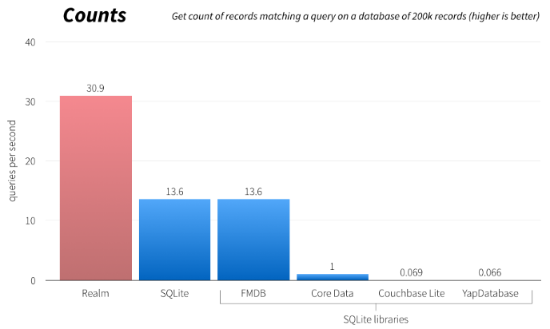
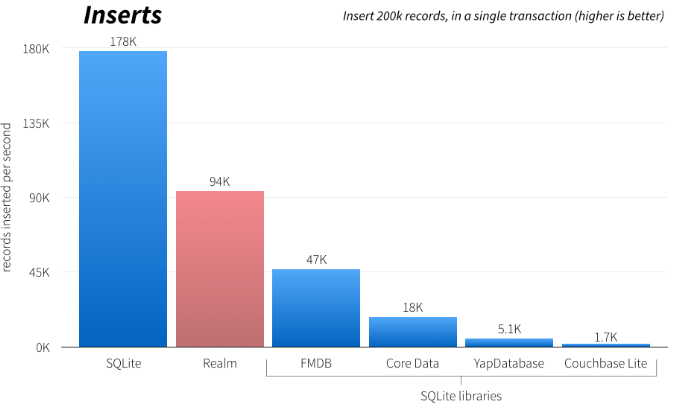

# 进阶Realm
在前面的篇章[《Realm的CRUD》](http://www.jianshu.com/p/8a9fb7a74ff1)介绍了怎么最简单的吧Realm给用起来，并通过一个Demo演示了CRUD的操作。除此之外Realm还提供了诸如消息通知、调试、数据加密等功能，我们一一来看。

## 0. 数据库realm设置
## 0. 数据定义

### 成员结构
基本的数据结构定义很简单，就和普通的NSObject定义一样：

	@interface Dog : RLMObject
	@property NSString *name;
	@end
	
	@interface Master : RLMObject
	@property NSString *name;
	@end

不同的是，这里没有使用nonatomic, atomic, strong, copy, weak等修饰符，因为Realm自己会管理所欲Realm对象的存储行为，所以也就不需要用到系统的机制来协助了。

如果想表示两个数据结构之间是一对一关联关系,那么类似二维表表中存储另一个表的主键key一样，我们只要在成员中增加一个关联对象的引用就可以了,比如说每个Dog都有一个主人Master：

	@interface Dog : RLMObject
	@property NSString *name;
	@porperty Master *owner;
	@end
这样就可以了，并且在查询的时候还可以用 `dog.owner == tomMaster`这样直接比较对象的方式来过滤查询条件。

那如果要像之前的demo中表示一个Master有多条Dog怎么办呢?一般SQL里面我们会定义一个新的表来维护这个关系，而Realm提供了一些集合对象，比如RLMArray来表示这样的“一对多”的关系：

	RLM_ARRAY_TYPE(Dog) // Defines an RLMArray<Dog> type

	@interface Master : RLMObject
	@property NSString *name;
	@property RLMarry<Dog *><Dog> *dogs;
	@end
首先要用Realm的宏“RLM_ARRAY_TYPE“来定义“RLMArray<Dog>”这个类型，然后和上面一样，在成员中增加一个“RLMarry<Dog *><Dog> *”成员表示"Dog *"的数组，这个表达方式在前篇文字有述，就不再赘述了。这样在查询的时候，Realm不仅会帮我们去的Master表中的数据，同时还会去Dog表中查询归属这个Master的Dog并填充到这个数组中。

### 行为接口
除了用成员的方式来设置数据结构关系，Realm还为每个RLMObject定义了一些接口来约束其默认表现。

#### 非空字段：requiredProperties
在用SQL描述表格的时候，我们经常会给一些字段加上"NOT NULL"来修饰，表示其必须要有值。这个时候只要实现：

	+ (nonnull NSArray<NSString *> *)requiredProperties;
返回一个成员名的数组就可以了。比如：

	@implementation Student
	+ (NSArray *)requiredProperties {
	    return @[@"name"];
	}
	@end

#### 建立索引：indexedProperties
在使用SQL的时候，为了提高查询效率，通常会为一些字段增减"Index"属性，Realm也是支持这个特性的：
	
	+ (nonnull NSArray<NSString *> *)indexedProperties;
同样返回一成员名的数据就可以了。比如：

	@implementation Student
	+ (NSArray *)indexedProperties {
	  return @[@"name"];
	}
	@end
按照人名建立索引。

#### 默认值：defaultPropertyValues
在使用SQL的时候，对于“NOT NULL”的变量，通常还会给一个默认值，Realm通过一个字典来支持：

	+ (nullable NSDictionary *)defaultPropertyValues;
这里返回的是一个字典，字典的key为一个个属性的名字，value为这个属性的默认值。比如：

	@implementation Student
	+ (NSDictionary *)defaultPropertyValues {
	    return @{@"name" : @"Jim", @"age": @12};
	}
	@end
默认的人名都是Jim而岁数都是12岁。
#### 主键：primaryKey
在二维表中，主键是个至关重要的属性，他表示了那个字段是可以唯一标记一行记录的，不可重复。Realm也是支持这一的特性：

	+ (nullable NSString *)primaryKey;
因为是主键，所以和上面不一样，直接返回主键属性的名字，而不是一个数组。比如：

	@implementation Student
	+ (NSString *)primaryKey {
	    return @"id";
	}
	@end
用id来表示各个唯一的Persion，其不可重复。

#### 不用Realm托管：ignoredProperties
因为Realm通过一个结构的成员来表示表中的各个键值，但是如果其中有一部分我们并不想其录入DB怎么办呢？比如在Persion中有个可以由age推导的年龄段（小孩、青年、成年），这个信息因为和age重复不用存储到DB中。为此Realm支持可以不托管RLMObject中的部分成员：

	+ (nullable NSArray<NSString *> *)ignoredProperties;
通过实现这个函数，然后返回不要存储的成员的名数组就可以了，比如：

	@implementation Student
	+ (NSArray *)ignoredProperties {
	    return @[@"ageLevel"];
	}
	#end
这样我们还可以自定义ageLevel的setter和getter，因为不用Realm托管，所以也就需要自己加上strong/weak等修饰了。

## 1. 创建与写入
有了表格对象的定义了后，要如何创建对象呢？最简单的方法就是和前面的Demo中描述的和NSObject一样逐个成员的去赋值，Realm还提供了两种个灵活的方法：
来看第一种，也就是传统的alloc+initXxx的方法
	
	- (nonnull instancetype)initWithValue:(nonnull id)value;
用一个数组或者一个字典给每个成员进行赋值。数组的内的元素会按照成员的顺序进行赋值，而字典则会将value赋值给Key的属性。比如：

	@interface Student : RLMObject
	@property int age;
	@property NSString *name;
	@end
	
	// (2) Create a Student object from a dictionary
	Student *student2 = [[Student alloc] initWithValue:@{@"name" : @"Tom", @"age" : @3}];

	// (3) Create a Student object from an array
	Student *student3 = [[Student alloc] initWithValue:@[@"Alex", @3]];
	
除了上面的方法还可以通过工厂创建方法：

	+ (nonnull instancetype)createInRealm:(nonnull RLMRealm *)realm
                               withValue:(nonnull id)value;
直接在某个realm中创建这个对象，就不用再去调用realm的add操作了，同样通过一个字典或者数组来进行初始化，如果数据库realm已经存在指定的主键了，那么这个方法会失败，此时可以考虑用update方法，在MySQL中我们常用replace into来实现同样的功能，比如：

	repalce into t_student (`f_name`, `f_age`)  values('Jim', 12)                        
Realm中则用：
	
	+ (nonnull instancetype)createOrUpdateInRealm:(nonnull RLMRealm *)realm
                                    withValue:(nonnull id)value;
具体的值一样通过字典或者数组来表示。

上面看到插入的值都是字典或者数据，那么这样想到App中常见的JSON由NSJSONSerialization解析出来是不是基本都是数组或者字典，那这样是不是可以直接处理JSON了呢？这里给一种尝试：

	// A Realm Object that represents a city
	@interface City : RLMObject
	@property NSString *name;
	@property NSInteger cityId;
	// other properties left out ...
	@end
	@implementation City
	@end // None needed
	
	NSData *data = [@"{\"name\": \"San Francisco\", \"cityId\": 123}" dataUsingEncoding: NSUTF8StringEncoding];
	RLMRealm *realm = [RLMRealm defaultRealm];
	
	// Insert from NSData containing JSON
	[realm transactionWithBlock:^{
	  id json = [NSJSONSerialization JSONObjectWithData:data options:0 error:NULL];
	  [City createOrUpdateInRealm:realm withValue:json];
	}];
	                              
## 2. 查询处理
在前一篇中我们已经介绍了查询得到的结果是一个类似NSArray的容器结构RLMResults。而这个结果还可以和SQL语句一样通过添加条件来进行排序、过滤等操作。
### 限制查询结果数目
比如在分页的场景中，我们通常只需要查询10个结果，在SQL中会用到"limit 10"这样的字眼，Realm的“懒查询”机制：Realm只有在需要用到数据才会去加载真正的数据 。这个特性，使得对于这样的limit操作不需要过多的操作，先查询出来所有的结果，然后从数组中遍历得出一部分就可以了，比如：

	// Loop through the first 10 Persion objects
	// restricting the number of objects read from disk
	RLMResults<Student *> *students = [Persion allObjects];
	for (NSInteger i = 0; i < 5; i++) {
	  Student *student = students[i];
	  // ...
	}
	
### 排序
对于Index的字段经常需要进行排序然后在取前面几个数据，SQL中有"sort by ‘id’"。Realm不仅支持对一个字段排序还可以多多个字段进行排序。

	- (nonnull RLMResults<RLMObjectType> *) sortedResultsUsingProperty:(nonnull NSString *)property
				                                                  ascending:(BOOL)ascending;
				                                                  
只要在RLMResults的结果上面执行sortedResultsUsingProperty然后给定属性名和是否逆序就可以了，是不是特简单。那要如何进行按照多个字段排序呢？

因为sortedResultsUsingProperty的结果也是RLMResult，所以可以再对这个结果做sortedResultsUsingProperty就可以了，可以用链式表达式来写的更简单。比如：

	RLMResults<Student *> *students = [Student allObjects];
	Student *sortStudent =  [[Students sortedResultsUsingProperty:@"age" ascending:NO]sortedResultsUsingProperty:@"name" ascending:NO] ]
	
这样得到的结果就是先按照age进行排序，然后再按照name进行排序。

### 过滤
对表中内容做条件查询应该是最常见的需求了，就是构建各种条件表达式。Realm支持接近自然语言的表达式类似“age > 10”这样表达式，同时进行了一些字段扩展，比如“BETWEEN”表示两个值之间等。

* 造作对象必须是RLMObject的一个属性
* 对 int, long, long long, float, double, 以及 NSDate属性支持 ==, <=, <, >=, >, !=, 和 BETWEEN操作，比如：age == 45
* 对象的判等（这个厉害，直接比较对象，SQL只能望其项背）。==和!=。 比如 [Employee objectsWhere:@"company == %@", company]
* 对于BOOL类型支持 ==和！= 判等操作
* 对于字符串（NSString）类型,支持==, !=, BEGINSWITH, CONTAINS, 以及 ENDSWITH操作，比如： name CONTAINS ‘Ja’。是不是比SQL更智能
* CONTAINS操作是区分大小写的
* 短路表达式也是支持的，用“AND”, “OR”, 和 “NOT”分别表示&&、|| 、！
* Realm提供了一个"IN" 操作来判断元素是否在列表中,比如：name IN {‘Lisa’, ‘Spike’, ‘Hachi’}
* Realm提供了“ANY”关键字来组合条件语句，比如： ANY student.age < 21
* 类似Limit，Realm提供了@count, @min, @max, @sum 和 @avg来表示结果的数目，对结果求最大、最小、和以及平均，比如：[Company objectsWhere:@"employees.@count > 5"]等同于"Limit 5"

## 3. 消息通知
在使用OC的过程中，大家肯定对KVO影响深刻甚至于ReactiveCocoa正是基于这样的特性来做了响应式编程。Realm对RLMRealm, RLMResults, RLMArray 和 RLMLinkingObjects也提供了这样的响应式支持，通过addNotificationBlock来添加一个回调block当有相关改动时就会通过回调通知过来。
### realm通知
假设这样的一个场景，当数据改变时我们需要更新UI，那怎样才知道有数据改动了呢？而且更新UI的操作又需要在主线线程中，而一般DB操作我们会单独启一个IO线程，那该如何是好呢？

别急，Realm为每个数据库realm对象都设置了一个数据改变时的通知：

	- (nonnull RLMNotificationToken *)addNotificationBlock:(nonnull RLMNotificationBlock)block;
block的定义如下：

	typedef void(^RLMNotificationBlock)(NSString *notification, RLMRealm *realm);

### 容器类型通知

### 触发通知

## 6. 版本兼容
做过生产环境的App都知道，策划和产品永远是不会放过程序的，之前定义的Model结构是永远不够用的，代码是肯定要改的，版本是肯定要升级的。这样我们就会遇到再之前的App1.0.1版本中，Student的定义是这样的：

	@interface Student : RLMObject
	@property int age;
	@property NSString *name;
	@end
	
但是在App2.0.1的时候，产品要求要分别显示用户的姓和名，那这咋办，只能拆这个Student结构啊，变成

	@interface Student : RLMObject
	@property int age;
	@property NSString *firstName;
	@property NSString *lastName;
	@end
	
变不要紧，但是要命的是，这个时候外网用户本地是有历史数据的，要怎么正常打开原来的数据呢？也就是兼容老数据呢？

做过这个需求的同学肯定说，简单啊，吧上面的Student定义为StudentV2，然后先读老版本数据，然后转换成新版本的再存起来。但是该如何判断本地文件是老版本呢？当然设计好的App这一点可能会考虑到，增加个版本的存储或者什么，但是这样操作起来也是比较麻烦的。Realm很早就考虑到了这个问题并和Protobuf一样提供了版本兼容的方案。

可以为RLMRealmConfiguration添加一个:

	void (^RLMMigrationBlock)(RLMMigration *_Nonnull, uint64_t)
的处理版本不同的block来做数据转换。而其`(assign, readwrite, nonatomic) uint64_t schemaVersion;`属性则可以用来表示不同的版本，默认版本号为0。

这个block里面传递了读入数据版本（uint64_t）这个用来作为版本判断是否要做转换已经要怎么转换，如果需要转换的话，则用这个`RLMMigration *`对其做[RLMMigration enumerateObjects:block:]操作，这里block的定义为

	typedef void (^RLMObjectMigrationBlock)(RLMObject *_Nullable, RLMObject *_Nullable)
会得到两个RLMObject对象，依次是读入的数据对象和即将存入的新的数据对象。因为这里没有具体数据结构定义，所以可以用字典的方式对各个属性进行赋值：

	RLMRealmConfiguration *config = [RLMRealmConfiguration defaultConfiguration];
	config.schemaVersion = 1;
	config.migrationBlock = ^(RLMMigration *migration, uint64_t oldSchemaVersion) {
	  if (oldSchemaVersion < 1) {
	    [migration enumerateObjects:Person.className
	                          block:^(RLMObject *oldObject, RLMObject *newObject) {
	      newObject[@"firstName"] = oldObject[@"name"]];
	      newObject[@"lastName"] = @"Node";
	    }];
	  }
	};
	[RLMRealmConfiguration setDefaultConfiguration:config];
这里为	RLMRealmConfiguration的migrationBlock属性给定一个转换的block，将老数据的name转换成"firstName"，而lastName则置为"None"。然后在用这个RLMRealmConfiguration创建realm就可以了。

## 7. 数据加密
不论是用SQL时候还是Realm，只要有了数据库文件，就可以用浏览工具打开查看，但是有的时候我们是不希望其他人拿到我们的数据库文件就可以直接读的，比如个人信息的存储。这个时候自然就想到了最直接的方法--加密。Realm提供了AES-256加密算法并用SHA2进行密文校验，使用起来也非常简单，只要生成一个256bit的秘钥（当然你要保护好这个秘钥，比如从安全的服务器信道传下来），然后将其给到RLMRealmConfiguration，在用这个RLMRealmConfiguration创建realm就可以了:

    uint8_t buffer[64];
    SecRandomCopyBytes(kSecRandomDefault, 64, buffer);
    NSData *keyData = [[NSData alloc] initWithBytes:buffer length:sizeof(buffer)]; 
    
    RLMRealmConfiguration *configuration = [RLMRealmConfiguration defaultConfiguration];
    configuration.encryptionKey  = keyData;    
    RLMRealm *realm = [RLMRealm realmWithConfiguration:configuration error:nil];
    
这里用了Security.framework里面的SecRandomCopyBytes得到一串随机数，作为秘钥，然后用这个秘钥给到RLMRealmConfiguration创建realm在行使用，这样数据存储时就会被加密了。

## 总结
Realm的消息通知、数据加密、JSON支持等特性让Realm直接区别于SQLite和CoreData。也为我们切换到Realm提供了理由支持。在性能上面根据[Realm的测试](https://realm.io/news/introducing-realm/)其高于SQLite两倍多，甩CoreData更不止一个数量级：

  

唯一没有经过验证的就是他的崩溃率了，在使用SQLite的过程中，崩溃还是比较常见的，不知道Realm这方面的表现如何，这个需要真实的App去验证，比如接入腾讯的Bugly来看。
## 参考
1. [Realm Objective-C](https://realm.io/docs/objc/latest/)
2. [Introducing Realm](https://realm.io/news/introducing-realm/)
3. [Realm API Reference ](https://realm.io/docs/objc/1.0.1/api/)
3. [Building an iOS Search Controller](https://realm.io/news/building-an-ios-search-controller-in-objective-c/)