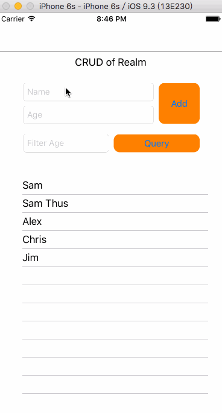

# Realm的CRUD
在一篇文章[尝鲜Realm](http://www.jianshu.com/p/6a58b8a6229a),我们了解到Realm标榜其为专注于移动平台的数据库，那既然是数据库，我们当然要看最基本的CRUD(Create/Read/Update/Delete)操作。当然在做这些基本的操作之前还是需要学习下Realm的基本知识。

## 0. Realm与我们熟悉的SQL
当使用SQL（SQLite）时，首先我们会设计关系数据库的结构，比如设计几个表，每个表里面哪些是主键、对哪些键做索引、默认值是什么等等，并将这些用SQL表示好，然后调用函数执行创建表的SQL语句或者通过一些ORM工具如：FMDB的函数创建表格，然后还要对应的创建一个class/struct来表示这个数据结构。而Realm抛弃了这繁琐的中间语言，而采用目标语言（比如Objective-C/Swift/Java）本身作为DSL(domain-specific language)来描述同样的类似表格的数据结构，由于是目标语言，其自身就能表达一个数据结构，因此带有了一些Model层属性，比如SQL很难描述某列的属性是另一个结构，需要自己定义数据结构来表示，而Realm的DSL则自动包含了这层定义。

比如我们来看个例子，描述省与城市的天气：省有其天气属性，同时还有其包含的城市；而城市也有天气属性。用SQL的话，我们可能会设计如下三个表：

	// table t_province
	CREATE TABLE t_provience (
		f_provience_id int, 
		f_proviecne_name varchar(255), 
		f_weather varchar(255)
		PRIMARY KEY (f_province_id)
	)

	// table f_city
	CREATE TABLE t_city (
		f_city_id int, 
		f_city_name varchar(255), 
		f_city varchar(255)
		PRIMARY KEY (f_city)
	)
	
	// relationship of city and province
	CREATE TABLE t_province_city (
		f_provience_id int, 
		f_city_id int, 
		PRIMARY KEY (f_proviece_id)
	)
表t_province表示省份信息，表f_city表示城市信息，这里为了凸显要表示的二者之间的关系，用了一个表t_province_city来表示一个省有几个城市。然后在程序中可能还要定义两个结构Province和City。

那同样的意思如何用Realm来表示呢？

用Realm的话只需要定义两个结构就可以了：

	@interface City : RLMObject
	@property int id;
	@property NSString *name;
	@end
	
	@interface Province : RLMObject
	@property int id;
	@property NSString *name;
	@property RLMArray<City *><City> *cities;
	@end

这里定义了两个结构（Model）：Provience和City。首先他们都需要继承Realm的RLMObject。City定义了name和id属性；Province除了定义了name和id还定义了了一个cities成员，而且其定义十分诡异：

* RLMArray: 表示一个RLMArray对象，可以认为是一个NSArray对象
* <City *>: 可以认为是每个Array成员的类型.
* <City>: 序列化的结构，按照找个类定义的成员和相关辅助函数来做序列化操作.

所以上面就是定义了： 一个按照结构City进行存储的City *的数组的指针。

其实就可以认为是City对象的数组就可以了。只是写法比较诡异。因为有这个数组的存在来维护“1 to n"的关系，所以也就不需要SQL里面定义的关系表了，而且已经用目标语言对数据结构进行了描述。

这样看来是不是觉得Realm会更简单呢？

## 1. 学生信息管理Demo
看了上面还不够，我们来看个例子，看看是不是操作简单、容易理解并且动作高效。

这里我准备了一个学生信息管理界面（实际上就一个学生名和年纪），可以添加、查询、搜索以及删除学生:

代码主要是由OC来实现的（下面的接口也是以OC为例讲解），具体的demo可以在[github](https://github.com/cz-it/myblog/tree/master/blog/iOS/db/realm/crud/example/realmcrud)进行下载。

## 2. Realm
realm的操作均由一个`RLMRealm`来管理，*我们称之为realm，可以把他理解为一个数据库。而其他继承自RLMObject都是一个个的数据表*。通过：

	+ (nonnull instancetype)defaultRealm;
可以得到一个默认的default的Realm对象，其将会在默认的位置：

* iOS: App路径的Document目录下，比如：/data/Containers/Data/Application/5232B434-092D-4B79-827F-1729BB417144/Documents/default.realm
* MacOS: 系统的Application Support 目录，比如:/Users/apollo/Library/Application%20Support/firstblood/default.realm

当然通常情况下还是需要创建我们自己的Realm，比如需要放在多个不同的文件中:

	RLMRealmConfiguration *config = [RLMRealmConfiguration defaultConfiguration];
	config.fileURL = [[[config.fileURL URLByDeletingLastPathComponent]
	                   URLByAppendingPathComponent:@"crud"]
	                  URLByAppendingPathExtension:@"realm"];
	NSLog(@"Realm file path: %@", config.fileURL);
	NSError *error;
	_realm = [RLMRealm realmWithConfiguration:config error:&error];
	
这里我们首先获取了默认的RLMRealmConfiguration，然后修改文件路径为一个新的NSURL，最后调用：
	
	+ (nullable instancetype)
	realmWithConfiguration:(nonnull RLMRealmConfiguration *)configuration
                 error:(NSError *_Nullable *_Nullable)error;
                 
创建Realm，它会在“/data/Containers/Data/Application/5232B434-092D-4B79-827F-1729BB417144/Documents/crud.realm”创建数据库文件。这样后面的数据存储就都在这个文件中了。  

## 3. Create
有了数据库（Realm）后，我们就可以开始创建表了。

首先关于表的描述，直接继承RLMObject即可，和继承NSObject一样，依次定义其成员即可，每个成员就是表中的一个属性，其类型就是基本类型包括有BOOL, bool, int, NSInteger, long, long long, float, double, NSString, NSDate, NSData等。不过和普通NSObject不同的是，这里属性不用指定其属性类型比如strong、weak等，Realm会管理器内存结构。比如我们建立一个表示学生的表：

	@interface Student : RLMObject
	@property int age;
	@property NSString *name;
	@end
表示了一个表Student，其有两个属性，一个int的age和一个NSString的name。定义好结构后，来看如何创建一条记录：

	// (1) Create a Student object and then set its properties
	Student *student = [[Student alloc] init];
	student.name = @"Jim";
	student.age = 10;
	
	// (2) Create a Student object from a dictionary
	Student *student2 = [[Student alloc] initWithValue:@{@"name" : @"Tom", @"age" : @3}];
	
	// (3) Create a Student object from an array
	Student *student3 = [[Student alloc] initWithValue:@[@"Alex", @3]];

如上，除了第一种和通常的NSObject一样的创建对象方式以外还有有另外两种方式可以实现。创建完记录后调用：

    [_realm beginWriteTransaction];
    [_realm addObject:s];
    [_realm commitWriteTransaction];
    
这里_realm是你自己创建的Realm数据库，调用：

	- (void)addObject:(nonnull RLMObject *)object;
将记录添加到数据库中存储。"beginWriteTransaction"和“commitWriteTransaction”可以认为和SQLite中的commit类似，用来表示一次存储事务，当commit后，相关数据就表示已经落地了。

## 4. Read

## 5. Update

## 6. Delete
对上面的操作都了解了的话，删除操作其实非常简单：

    [_realm beginWriteTransaction];
    [_realm deleteObject:s];
    [_realm commitWriteTransaction];
    
首先获得要删除的Student对象，当然这里说的是Demo，在具体应用中就是继承了RLMObject的对象。然后在事务提交中调用 ：

	- (void)deleteObject:(nonnull RLMObject *)object;

即可影响到具体物理文件里面的记录，是不是很简单，其实删除操作本来也没有特殊的地方。

## 7. 总结
通过一个demo例子中展示的Realm的CRUD操作，我们会发现，首先不能完全用SQL的经验来设计Realm，比如他是可以直接通过对象来表示两组数据之间的"1 to n"、“1 to 1”等关系的，另外操作直接针对一个RLMObject对象来进行的，再不用SQL来构造语义了。但同时SQL的经验有可以运用到对Realm的使用中。这里只介绍了基本的Realm的API来实现CRUD操作，Reaml还提供了诸如通知、动态更新、调试等高级功能，我们再下一篇继续学习。
## 参考
1. [Realm Objective-C](https://realm.io/docs/objc/latest/)
2. [Realm Reference](https://realm.io/docs/objc/latest/api/)