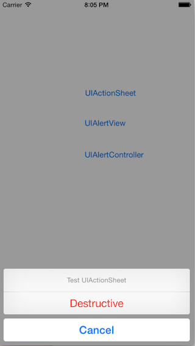
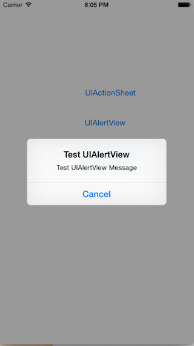
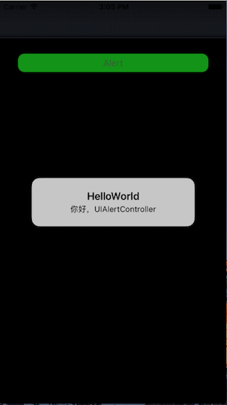

#庖丁UIKit之UIAlertController
做UI时，弹框消息基本是个必选项。无论是提示用户Warning消息，还是为用户提供一个交互选择，都是非常不错的选择。在iOS上UIKit肯定也是提供了相关功能的，在iOS8以前，UIKit提供了两种弹框： UIActionSheet 和 UIAlertView 。一个是从底部弹出，通常用于选择；一个是在界面中间弹出，一般用于提示。二者效果如下：

 

而在iOS8(包含iOS8)以后，UIKit通过UIAlertController将二者进行了统一，并提供了选项单元UIAlertAction，用于自定义弹框内容，显的更加灵活。

## 0. HelloWorld
先上代码：

    @IBAction func onAlert(_ sender: AnyObject) {
        let alert = UIAlertController(title: "HelloWorld", message: "你好，UIAlertController", preferredStyle: .alert)
        self.present(alert, animated: true) { 
            print("Show Alert!")
        }
        
    }
    
在看效果图：

代码逻辑很简单，就是在需要的地方，又按钮触发上面的逻辑，先创建一个UIAlertController然后`present(_ viewControllerToPresent: UIViewController, animated flag: Bool, completion: (@escaping () -> Swift.Void)`这个ViewController，就可以了。

> 从图中可以看到，效果是有了，但是交互上有点缺陷，没法消除掉这个alert。

## 1. 在界面中间弹出蒙版提示

## 2. 在界面底部弹出选择提示

## 3. 定制UIAlertAction选项

## 4. 总结