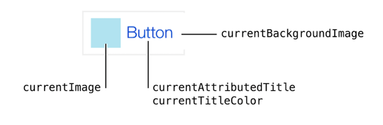

#庖丁UIKit之UIButton
App中最常见的也是基本少不了的交互，就是按钮了。UIKit通过UIButton来提供按钮服务。 
UIButton的基本结构如图：

为了方便使用，UIKit提供的五中固定结构的按钮类，由UIButtonType枚举来表示：

* case system ：
* case detailDisclosure ：
* case infoLight ：
* case infoDark ：
* case contactAdd ：

除了上面五种，还有一种`case custom`表示完全自定义，用户根据上面介绍的UIButton的结构，自行组织按钮的外形和效果。

## 0. 各种各样的按钮

## 1. 使用步骤

* 选择一个类型类创建一个按钮
* 设置按钮的背景图片或者标题，并设置好大小
* 为按钮添加触发执行的动作
* 调整按钮在UI中的位置
* 提供辅助信息和国际化的文字或者图片

## 2.为按钮添加触发动作
	

## 3. 设置按钮的状态属性

    UIControlStateNormal  
    UIControlStateHighlighted 
    UIControlStateDisabled    
    UIControlStateSelected    
    UIControlStateFocused

## 4.通过IB来设置Button

## 5. 总结

##参考
[UIButton API Reference](https://developer.apple.com/reference/uikit/uibutton)
[Cocoa Application Competencies for iOS](https://developer.apple.com/library/content/documentation/General/Conceptual/Devpedia-CocoaApp/TargetAction.html#//apple_ref/doc/uid/TP40009071-CH3)