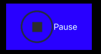
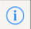
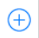

#庖丁UIKit之UIButton
App中最常见的也是基本少不了的交互，就是按钮了。UIKit通过UIButton来提供按钮服务。 
UIButton的基本结构如图：

包含一个图标UIImage,一个标题UILabel。

UIButton继承自UIControl,而UIControl又继承自UIView，所以UIButton本质上是一个UIView，可以认为是一个容器View。

所以在IB里面，UIButton有“Image” 和“Background”两个属性可以设置，并且都可以设置图片，其中这个“Image”其实只是按钮的一部分，还可以追加一段标题。如图中：

背景设置成蓝色，一个图标以及一个标题“Pause”。

## 0. 各种各样的按钮

为了方便使用，UIKit提供的五中固定结构的按钮类，由UIButtonType枚举来表示：

* case system ： 最常用的，标题和图片都可以自由设置，并且按下的时候会变暗，产生闪烁的点击效果
* case detailDisclosure ：外形固定，是一个感叹号，用于表示点击后有说明信息的情况。
* case infoLight ：和“detailDisclosure”但是点击时会亮色闪烁，背景变大，特别醒目
* case infoDark ： 和“detailDisclosure”但是点击时会暗色闪烁，背景变大，特别醒目
* case contactAdd ：外形固定，是一个➕号，用于表示添加的意思

除了上面五种，还有一种`case custom`表示完全自定义，用户根据上面介绍的UIButton的结构，自行组织按钮的外形和效果。

Apple的[UI设计规范](https://developer.apple.com/ios/human-interface-guidelines/ui-controls/buttons/)描述了哪些场景下推荐用系统自定义的按钮。

## 1. 使用步骤

### step1:选择一个类型类创建一个按钮

		let codeBtn:UIButton = UIButton(type:.system)
UIButton的构造函数需要指定其类型

### step2: 设置按钮的背景图片或者标题，并设置好大小
	
		func setTitle(_ title: String?, for state: UIControlState)
		func setImage(_ image: UIImage?, for state: UIControlState)
通过调用`setTitle`和`setImage`设置标题和图片。每个UIButton都有好几个状态UIControlState。参见下面的状态介绍

当然还有其他几个选项，但是基本用不上，这里也没有必要理出来。
		
### step3: 为按钮添加触发执行的动作

	codeBtn.addTarget(self, action: #selector(onCodeBtnClicked(sender:)), for:.touchDown)
	
    @IBAction func onCodeBtnClicked(sender: UIButton)  {
        
    }
    
这里定义了一个`@IBAction`的Action方法，然后调用UIButton的`func addTarget(_ target: Any?, action: Selector, for controlEvents: UIControlEvents)`	添加按钮在对应状态下的触发动作。

### step4: 调整按钮在UI中的位置
UIButton的本质是一个UIView，所以通过设置其Frame就可以设置设置按钮的大小和位置。当然作为后现代化iOS UI，肯定不应该用frame来做布局，通过设置UIView的autolayout规则，来对UIButton进行大小和位置布局才是最佳选择。

### step5: 提供辅助信息和国际化的文字或者图片
对于UIButton的标题和图片，根据系统获得的localizations来进行设置。当然最简单的就是把Plist里面的location配置成对应的位置，比如“zh-CN”，这样默认的按钮显示就是中文了。

## 2.为按钮添加触发动作
UIButton继承自UIControl，所以他也继承了UIControl的事件触发功能，而UIButton通常是不可以编辑的，所以主要是触碰事件。触碰事件的定义可以参考Apple的官方手册[Target-Action](https://developer.apple.com/library/prerelease/content/documentation/General/Conceptual/Devpedia-CocoaApp/TargetAction.html#//apple_ref/doc/uid/TP40009071-CH3)

上面介绍了用`func addTarget(_ target: Any?, action: Selector, for controlEvents: UIControlEvents)`来为按钮添加特定状态时所发生的动作。这里target表示的是action所属的对象，也就是要触发那个对象的那个方法。而Selector是一个方法回调。其可以为：

	@IBAction func doSomething()
	@IBAction func doSomething(sender: UIButton)
	@IBAction func doSomething(sender: UIButton, forEvent event: UIEvent)
	
三种形式，`@IBAction`的修饰，使得其可以被连接到IB的上。`sender: UIButton`表示是哪个按钮被触发了，这样在函数总通过判断谁触发的，就可以为多个按钮绑定同一个“IBAction”了。最后`forEvent event: UIEvent`提供了颗粒度控制，判断当前是什么事件被触发了，是否需要相应。

当然，Swift中的Selector和OC中的不同，用“#”大头，后面接函数原型，比如：

	#selector(onCodeBtnClicked(sender:))
UIButton定义了几种常见的事件，而不用通过“UITapGestureRecognizer”来实现：

事件| 事件名| 意义
---|---|---
单击| touchDown | 一般表示单击，当然多次按，也会被触发
双击|touchDownRepeat | 一般表示双击，当然多余两次的连续按也会触发，通过tapCount可以判断按了几次

当然UIControl还定义了其他一些触摸事件比如
touchDragInside、
touchDragOutside、
touchDragOutside、
touchDragExit、
touchUpInside、
touchUpOutside、
touchCancel但是对按钮基本上都用不上。

## 3. 设置按钮的状态属性
同样因为UIButton继承自UIControl，所以其有个`UIControlState`属性表示当前所处的状态，UIControlState定义了很多个状态，但是UIButton通常只用到如下几个状态。

状态| 意义
---|---
normal| 没有被触发的情况下
highlighted| 按钮被按下，但是没有抬起的状态
disabled| 按钮不可用的状态
selected| 选中状态，比如默认选项

所以只要对其进行背景或者标题文字的设置就可以了。最常见的就是，当按钮被按下的时候，设置其背景图片为暗色，这样营造出一种按下时闪烁的效果。这个效果系统自带的五中按钮都自动实现了，如果是自己自定义的按钮则要自己去实现。

## 4. 总结
UIButton表示的按钮分成五大类加上一类自定义，一般情况下使用.System即可，需要特殊效果时，可以使用.Custom进行自定义，按照Apple的UI设计规则，部分场合最好还是用系统提供的五大类型按钮。为按钮添加的点击动作可以按照不同的点击事件进行区别，并可以设置按钮在对应状态下的外观表现。

##参考
[UIButton API Reference](https://developer.apple.com/reference/uikit/uibutton)
[Cocoa Application Competencies for iOS](https://developer.apple.com/library/content/documentation/General/Conceptual/Devpedia-CocoaApp/TargetAction.html#//apple_ref/doc/uid/TP40009071-CH3)