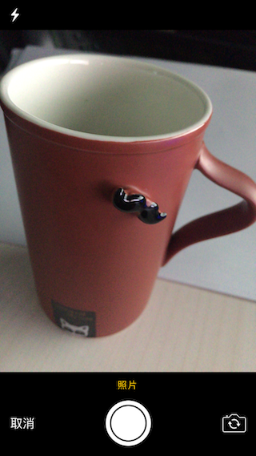
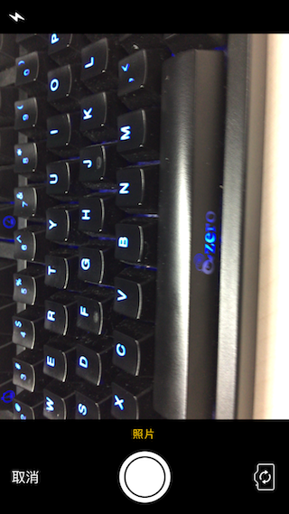
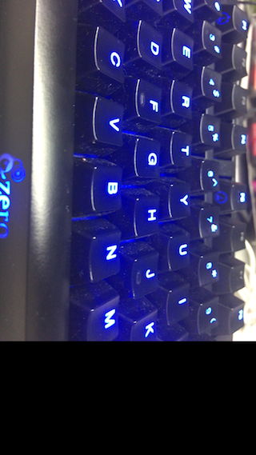

#庖丁UIKit之用UIImagePickerController拍照

UIImagePickerController是UIKit提供的一个提供系统拍照、摄像以及访问本机媒体资源的ViewController工具。因为他是一个服务性的ViewController,所以其基本使用就是"present"一个ViewController。

这里我们先介绍如何用UIImagePickerController提供的界面进行照片的拍摄。由于是UIImagePickerController提供的一个系统服务，那么自然的在UI上就会有些固定的地方，不过UIImagePickerController也提供了一些自定义的可能。来看一个常用的拍照界面。

## 0. 设置UIImagePickerController进行拍照

UIImagePickerController在获取图像资源，首先需要指定一个资源源，有三类：

* photoLibrary ： 照片库
* camera ： 摄像头
* savedPhotosAlbum ： 照片集

其实就是从摄像头采集还是从手机系统里面的图片进行选取。

在选择了图像资源后，还需要指定那种资源：

* kUTTypeImage： 图片
* kUTTypeMovie ：视频

这里我们是要拍照，当然是选择图片资源了。 

要拍照的话，首先检查摄像头资源是否可用：

	if UIImagePickerController.isSourceTypeAvailable(.camera) {
		...
	}
通过调用“UIImagePickerController”的类方法：

	class func isSourceTypeAvailable(UIImagePickerControllerSourceType)
	
检查其是否支持从摄像头采集资源。

然后再设置资源为摄像头：

	picker.sourceType = .camera
设置`var sourceType: UIImagePickerControllerSourceType`实例变量为摄像头。

设置了摄像头资源还不够，因为iPhone通常有两个摄像头：前置摄像头和后置摄像头。

这里先判断对应的摄像头是否可用。如果可用优先选择后置摄像头：

    if UIImagePickerController.isCameraDeviceAvailable(.rear) {
        picker.cameraDevice = .rear
    } else if UIImagePickerController.isCameraDeviceAvailable(.front) {
        picker.cameraDevice = .front
    } else {
    }
通过调用“UIImagePickerController”的类方法：

	class func isCameraDeviceAvailable(UIImagePickerControllerCameraDevice)

判断是否支持后置摄像头。
	
最后如上面所说，要把类型设置成照片类型：

    let types = UIImagePickerController.availableMediaTypes(for: .camera)
    if let ts = types {
        if ts.contains(kUTTypeImage as String) {
            picker.mediaTypes = [kUTTypeImage as String]
            Confirm(title: "kUTTypeImage", message: "设置为采集照片模式")
        }
    }
首先调用“UIImagePickerController”的类方法：

	`class func availableMediaTypes(for: UIImagePickerControllerSourceType)`
	
查询摄像头支持的所有类型媒体，然后再判断图片类型kUTTypeImage是否包含在其中，如果在的话，就设置可以采集的类型的`var mediaTypes: [String]`为 `[kUTTypeImage as String]`。这样就完成设置采集源以及采集资源的类型操作了。

## 1. 进行拍照
在进行了设置后，就可以准备进行拍照了。用UIImagePickerController拍照的过程，实际上是拉起一个包含拍照功能的ViewController,那么只要“present”这个ViewController出来就可以了：

    self.present(picker, animated: true) {
        //
    }
    
如果一切正常的话，这时候应该就可以看到弹出来的拍照界面了:

这里就和操作系统应用“相机”里面的拍照一样，但是如果拍照完，点击“使用照片”，会发现虽然拍照的界面消失了，但是系统“照片”里面却没有照片，同时也没有其他提示。

因为使用UIImagePickerController拍照的过程是个系统服务，是异步的，当没有为其注册Delegate的时候，就会像上面一样，没法获得拍照的结果。Delegate需要实现协议：

	@protocol UIImagePickerControllerDelegate<NSObject>
	@optional
	- (void)imagePickerController:(UIImagePickerController *)picker didFinishPickingMediaWithInfo:(NSDictionary<NSString *,id> *)info;
	- (void)imagePickerControllerDidCancel:(UIImagePickerController *)picker;
	@end
一个是点击保存的时候的回调，一个是用户点击取消时候的回调。无论哪个回调被执行，要想回到之前的用户界面上面都需要对picker做“dismiss”操作，记住UIImagePickerController的本质是拉起一个系统的ViewController来拍照，所以不需要的时候自然要取消它：

    picker.dismiss(animated: true) { 
        //
    }	

在用户点击保存是，我们可以通过info来获得采集到的图片的信息其中Key就是所存对象的类名

Key| 值类型| 描述
---|---|---
UIImagePickerControllerEditedImage|UIImage| 表示用户在拍摄的照片上面修改后图片数据
UIImagePickerControllerMediaMetadata| NSDictionary|只在使用摄像头并且拍摄图片的时候才会有，表示图片的描述数据
UIImagePickerControllerMediaType|NSString|  kUTTypeImage表示图片，kUTTypeMovie表示视频
UIImagePickerControllerCropRect|NSValue|  实际上是CGRect对象
UIImagePickerControllerOriginalImage| UIImage| 表示拍摄时图片数据

通过这类枚举的Info数据，可以获得拍照后的数据结果，比如想将拍摄后的结果保存到“照片”中。可以调用：

	func UIImageWriteToSavedPhotosAlbum(_ image: UIImage, 
                                  _ completionTarget: Any?, 
                                  _ completionSelector: Selector?, 
                                  _ contextInfo: UnsafeMutableRawPointer?)
                                 
将照片进行保存。

> 注意：Swift接口只有在iOS8+才有这个接口，其Objective-C版本则从iOS2.0+就开始有了，所以如果是用Swift写的App(Swift支持iOS7+)，那么需要对iOS7做一个OC的桥接处理。

如下代码：

    func onSave(_ image: UIImage, didFinishSavingWithError error: NSError?, contextInfo: UnsafeRawPointer) {
        if let error = error {
            // we got back an error!
            Confirm(title: "Save Failed", message: error.localizedDescription)
        } else {
            Confirm(title: "Save Succfull", message: "Your altered image has been saved to your photos.")
        }
    }
    
    /** UIImagePickerControllerDelegate  **/
    func imagePickerController(_ picker: UIImagePickerController, didFinishPickingMediaWithInfo info: [String : Any]) {
        //
        let img = info[UIImagePickerControllerOriginalImage]
        UIImageWriteToSavedPhotosAlbum(img as! UIImage, self, #selector(onSave(_:didFinishSavingWithError:contextInfo:)), nil)
        
        picker.dismiss(animated: true) { 
            //
        }
    }                                 

这里对Swift不熟悉可能会有些疑惑，首先这里需要一个`selector `回调函数，原型为

	(_ image: UIImage, didFinishSavingWithError error: NSError?, contextInfo: UnsafeRawPointer)
	
而在Apple的[官方文档](https://developer.apple.com/reference/uikit/1619125-uiimagewritetosavedphotosalbum)中却并没有这个函数原型的描述，而是其对应的OC版本：

	- (void)               image: (UIImage *) image
    didFinishSavingWithError: (NSError *) error
                 contextInfo: (void *) contextInfo;
                 
由于保存文件需要进行文件写磁盘操作，所以保存文件是一个异步的操作，当保存完成或者出错的时候，会通过上面的回调进行通知，由error来表示，另外回调还可以通过contextInfo传递一个用户自定义数据。

UIImageWriteToSavedPhotosAlbum的第一个参数是要保存的图片，第二个参数是回调的宿主对象，第三个则是上面说的回调，最后一个就是回调中的用户自定义数据了。

这里我们仅仅用了一个Alert提示框。完整的Demo可以参考[GitHub](https://github.com/cz-it/myblog/tree/master/blog/iOS/ui/uiimagepicker/examples/UIImagePickerForImageDemo)

## 2. 自定义拍照界面

UIImagePickerController虽然使用起来非常简单，不过其也提供了一些自定界面的的方式，比如是否可以修改拍照后的照片（主要就是放大缩小）；拍照、取消按钮；闪光灯设置等。

不过经过各种实验，摄像的界面基本外形就是下面一个大黑框，上面是拍照界面这个基本结构改不了，而且黑框大小没法改变。这个基本是事实了，如果还想更多的自定义，还是得用AVFoundation.framework进行定制。

比如设置:

	picker.showsCameraControls = false
此时得到界面就变成了：

空空的一块板了，这时候需要调用：

	func takePicture()
	
才能达到正常情况下按拍照键的效果。那要如何布局UI呢？

答案是：

	var cameraOverlayView: UIView?
为其赋值一个自定义的View，就可以在自定义的View上进行交互设计了。比如这样的效果:

参考代码：

    func navigationController(_ navigationController: UINavigationController, didShow viewController: UIViewController, animated: Bool) {
        cameraView.frame = CGRect(x: 0, y: self.view.bounds.size.height-100, width: self.view.bounds.size.width, height: 100)
        cameraView.backgroundColor = UIColor.blue
        cameraView.alpha = 0.5
		 // ... set for buttons
        picker.cameraOverlayView = cameraView
        
    }
    // action for buttons
	@IBAction func onTakePhoto () {
        picker.takePicture()
    }
    
    @IBAction func onSwitchCamera() {
        if cameraMode == .rear {
            picker.cameraDevice = .front
            cameraBtn.setTitle("Rear", for: .normal)
            cameraMode = .front
        } else {
            picker.cameraDevice = .rear
            cameraBtn.setTitle("Front", for: .normal)
            cameraMode = .rear
        }
    }
    
    @IBAction func onFlashMode () {
        if flashMode == .auto || flashMode == .on {
            picker.cameraFlashMode = .off
            flashMode = .off
            flashBtn.setTitle("FlashON", for: .normal)
        } else {
            picker.cameraFlashMode = .on
            flashMode = .on
            flashBtn.setTitle("FlashOFF", for: .normal)
        }
    }

因为UIImagePickerController是被“present”出来的，他还实现了“UINavigationControllerDelegate”来感知被“present”的结果，所以我们可以在

	func navigationController(_ navigationController: UINavigationController, didShow viewController: UIViewController, animated: Bool)
里面设置自定义View的效果。
	
这里在这个自定义的View上面做一些UI交互，比如做闪光灯的模式选择：
设置`cameraFlashMode `为：

	public enum UIImagePickerControllerCameraFlashMode : Int {	    case off	// 关闭
	    case auto	 // 自动
	    case on // 打开
	}

又比如说上面设置为背部摄像头时，给一个UI控制选择前置摄像头：

	picker.cameraDevice = .front
	

	

总的来说，自定义的范围还是非常有限的。

## 3.总结
使用UIImagePickerController按照设置数据源；设置采集端；设置采集数据类型之后，就可以通过系统提供的界面进行照片拍摄，并获得拍照后的图片数据了。虽然也可以对拍照界面进行自定义设置，但是幅度有限。如果对拍照要求不高，可以使用这个方法来进行图片采集，如果需要更多的控制，还是需要使用AVFoundation.framework提供的功能来实现。