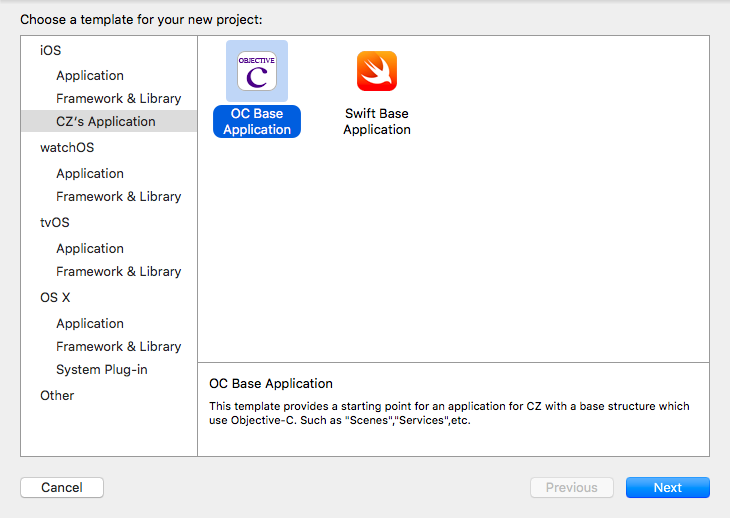
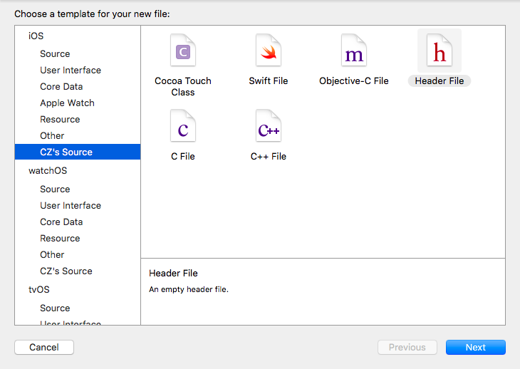
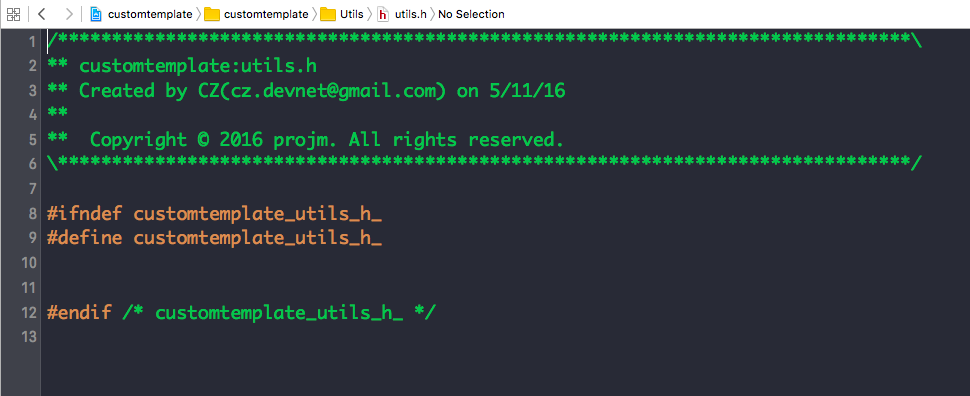

#定制你的Xcode工程目录和文件模板
在创建Xcode工程的时候，有几个默认的模板可以选择，比如“Application”里面“Signal View Application”，或者是一个“Framework & Library”里面的"CocoaTouch Framework"。这些模板点击进去后就为我们自动生成了一些文件，并且文件中也有些模板注释。但是这样就够了么？Apple的设定是否能满足你的需求呢？

先来看下我的定制效果：

当在Xcode里面点击"File"->"New" -> "Project"的时候，首先得到工程模板的选择，这里我自定义了一个自己的“Application”模板

也就是这里的“CZ's Application”，里面有两个模板工程，一个是OC的一个是Swift的，这里我们看选择一个OC工程模板后的结果。

这里我们可以和最常用“Signal View Application”做个对比，首先没有“Main.storyboard”了，也没有了那个特定"View"的“ViewController”，取而代之的我自己规划的 

* BootLoader: 启动时操作，比如初次安装的欢迎页，是否显示广告页
* Scenes: 各个操作界面的场景
* Services: 将MVC中较为重和独立的逻辑（比如后台API访问）抽成独立的Service供其他模块使用
* Utils: 工具目录
* ThirdPart: 没有CocoaPod支持的或者一些开源的代码片段

再在目录上点击右键，然后选择“New File”看文件选择界面

这里看到多了一个“CZ's Source”，在里面有常见文件类型可以选择。这里选择.h文件，新建文件如下：

可以看到这里和"//"注释的默认模板不同的地方。头文件的ifndef也和google的C++风格类似了。

## 1. Xcode模板文件结构
Xcode的模板文件和vim/emacs等编辑器一样有两个位置，一个系统的全局位置，一个用户的自定义位置,现在用Xcode基本是做iOS开发，这里就只以iOS作为例子讲解，后面的文章都是说iOS工程的：

	全局位置：/Applications/Xcode.app/Contents/Developer/Platforms/iPhoneOS.platform/Developer/Library/Xcode/Templates/Project Templates/
	用户自定义位置：~/Library/Developer/Xcode/Templates/
	
全局路径需要root的读写权限，一般不用修改他，把自己的定制模板文件放在用户自定义的路径下就可以了。

## 2. Xcode模板定制
### 工程模板定制

### 文件模板定制

## 3. 总结
文章开头的自定义模板可以在我的[Github](https://github.com/cz-it/cz_base_app)上下载，修改下建立个软连接就可以直接使用了。

	cd ~/Library/Developer/Xcode/Templates/
	ln -s YourPath/github.com/cz-it/cz_base_app/Project\ Templates Project\ Templates 
	ln -s YourPath/github.com/cz-it/cz_base_app/File\ Templates File\ Templates

现在可以搜到蛮多的定制模板的文章都是Xcode4或者6的，其方法也已经不再适用了，另外在Xcode7的7.2和7.3在工程结构上也有些比较大的改变（模板文件路径），所以定制模板的方法还是要与时俱进，要对Xcode进行适配。

另外由于Apple自己没有公开他们的工程目录结构定义（plist的格式说明文档），所以我们也只能根据Xcode已有的文件进行逆向猜想，还有些诸如Target定义、info plist修改在文中都没有涉及，这个过程还需要自己参考Xcode的模板，不断的尝试，才能得到自己想要的效果。

## 参考
1. [Xcode Build Setting Reference](https://developer.apple.com/library/ios/documentation/DeveloperTools/Reference/XcodeBuildSettingRef/0-Introduction/introduction.html#//apple_ref/doc/uid/TP40003931-CH1-SW1)
2. [XCode 4 Projects and Files Template Folder](https://snipt.net/raw/b216c160f38e9b3c095222607739b21c/?nice)
2. [How to Create Custom Project Templates in Xcode 7](http://www.telerik.com/blogs/how-to-create-custom-project-templates-in-xcode-7)