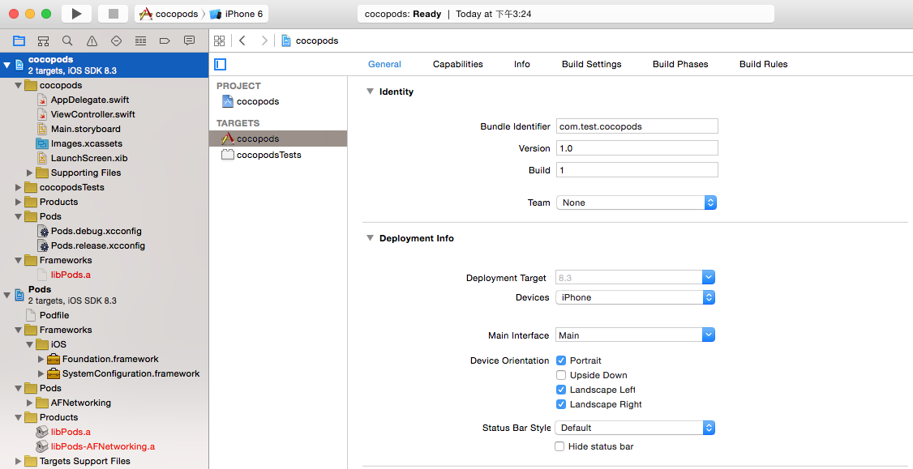

#用Cocoapods管理包依赖
在安装Linux软件时，我们是不是经常会遇到这样的问题：好不容下载了automake的源码包，结果./configure 时候提示先装autoconf，然后下载了个autoconf的源码，安装好后
发现automake的configure提示说autoconf的版本不对。

这一百个闹心的事，在后来的90后世界时很少出现了，因为现在的在Linux发行版引入了包管理系统来解决这个问题。目前有两大系列（当然还有其他系列），一个是Redhat主导的yum
命令的rmp软件包系列（Fedora/Redhat/CentOS），另一个是Debine引入的apt-xxx系列的deb包(Debine/Ubuntu)。这些包管理系统做的事情是主要为了解决软件安装过程的
依赖关系。比如安装A的1.9.1版本，需要先安装B的1.3.1以上版本，以及C的1.4.2以上版本。

同样的事情还会出现在我们引用第三方SDK库的时候，比如在Github上看到一个非常好用的X语言的Json库，然后下载到本地，集成到项目中。某天，发现这个Json库有个bug，同时发现
其在一个较新的版本中被修复了，那么这个时候，又要去Github上，吧代码down下来，然后再合入我们的项目中。如果项目结果组织的清晰（比如有目录名标示），替换过程还算好。否则
就是一百个痛快。在C/C++的世界里面，其实主要就是这么来引用的第三方库的：
> 1.若要使用第三方库，需要手动去找资源下载
> 
> 2.若要更新库，就必须重新下载合入

在开源如火如荼、Github成为程序员Blog的今天，这样的问题更容易出现。因此现代化的语言要么通过工具来解决这样的问题。如Python的easy_install
,Java世界里面的Marven,Node.js（非新语言）的npm.要么在语言的层面便提供了支持,如Golang的 "go get"

在Mac的世界里面，CocoaPods就承担了此重任，其支持Objective-C以及Swift。

## 一、安装Cocoapods
Cocoapods是用Ruby写的，Mac下一般Ruby环境以及默认安装好了，如果没有则需要用brew或者手动安装下ruby的环境，这里不做介绍。打开终端，输入命令：

	sudo gem install cocoapods
	
即可。由于ruby镜像被ZF的大墙挡住，因此可以选择配置国内的Ruby镜像，比如配置TaoBao的镜像：

	$ gem sources --remove https://rubygems.org/
	
	$ gem sources -a http://ruby.taobao.org/

安装好了以后，我们可以运行：
	
	pod --version 

来查看Cocoapods的版本，从而确认完成安装。至此就完成了对Cocoapods的安装了，是不是太简单？
	
## 二、安装第三方库
Cocoapods通过使用一个配置文件来管理工程中依赖的第三方库文件。在XCode工程的工程目录下，也就是xxx.xcodeproj 的同级目录创建一个Podfile文件。Cocoapods官方文档是用
touch命令生成 `touch Podfile`。这里我们以最常用到的AFNetworking库为例，创建一个Podfile文件，然后写上内容：

	pod 'AFNetworking', '~> 0.2'  
	
表示选择AFNetworking0.2的版本前最近的版本，也就是0.1.x不包含0.2。此时目录结构如下：

	// 这里假设工程名叫做Cocoapods
	Podfile			Cocoapods.xcodeproj
	Cocoapods		CocoapodsTests
	
然后再Podfile同级目录下运行:

	pod install 
	
	// 提示：
	Analyzing dependencies
	Downloading dependencies
	Using AFNetworking (0.10.1)
	Generating Pods project
	Integrating client project

说明此时已经安装好AFNetworking 2.0前最近版本的库。此时我们再看目录结构为：

	Podfile			Pods			Cocoapods.xcodeproj  CocoapodsTests
	Podfile.lock		Cocoapods		Cocoapods.xcworkspace
	
这里我们发现多了3个文件：

	Podfile.lock
	Pods
	Cocoapods.xcworkspace

Podfile.lock 记录了一些Meta信息，如Cocoapods的版本、依赖库的版本等，可以认为是类似依赖信息的数据库文件。Pods目录里面存放了依赖库的库文件，如这里的AFnetworking。
Cocoapods.xcworkspace是一个类似XCode工程文件Cocoapods.xcodeproj文件的工程文件。

使用了Cocoapods以后，就可以忽略Cocoapods.xcodeproj了，并且不能用改文件打开工程，要使用Cocoapods生成的这个xcworkspace。这里可以直接用XCode打开：

此时，直接“Command+B”就可以直接编译工程。和一个普通的XCode工程是一样的。

看左边的工程目录结果，发现比普通的工程多了一个Pod工程依赖。原来的工程中多了一个“Pods”和“Frameworks”的Group。这两个Group主要就是配置文件和库的依赖。其他的Group
还是和一个普通的XCode工程一样的。在使用时，我们可以忽略这些新增的目录、工程已经Group。添加文件、设置工程就在原来的XCode工程上按一般的规则设置即可。

在Pods工程中，我们可以找到Pods的Group下有AFNetworking，所有第三方的framework都会在这个Group中。这里可以看到头文件和.m等其他文件，需要时可以过来进行查看。在工程中就可以直接引用AFNetworking库的API了。

## 三、Repo的Hint

在上面使用Cocoapods的过程中，使用pod工具生成了三个文件夹，那么在我们的Repo中，该如何对待这些文件呢？其实对于XCode工程，最好是在创建工程的那一刻就创建好.gitignore
文件，因为XCode会自己进行Add操作，当然这个是没有使用XCode的代码管理工具的情况下。在.gitigore中，我们把和Cocoapods相关的四个文件中仅“Podfile”放入git托管，二把其他三个生成的文件均写入.gitignore里面。这样多人之间仅共享配置文件，通过pod进行实时生成。

## 四、Podfile语法
在上面的Podfile文件中，只写了一句话：

	pod 'AFNetworking', '~> 2.0'
	
表示依赖2.0版本前最近的AFNetworking库。这是一个非常简单的依赖语句，Podfile有其自己的语法规则podspec的DSL来描述依赖规则，通过podspec可以定义更多的依赖关系。在Podfile中，只要一部分
规则即可。

Podfile通过“target”来表示依赖关系的节点。每个Podfile有一个默认的Target，就是原来XCode工程文件中的第一个Target。所以上面的那一句话，其实是为我们的默认Target定义了一条依赖AFNetworking的规则。

在Target中提供了一些配置选项：

1. 指定静态库的编译平台

	platform :ios, "4.0" # 指定在iOS 8.0系统上进行编译

2. 指定工程名
默认情况下，Cocoapods选择Podfile同级目录下的xcodeproj文件为默认工程，这也是上面为什么说要吧Podfile放在xcodeproj文件同级目录的原因，但是也阔以进行指定
	xcodeproj 'MyProject' # 表示从这个XCode工程中选择Target
	
3. 显示指定连接的库文件
指定某个Target需要连接的库文件
	link_with 'MyApp'  # 表示需要连接MyApp库

