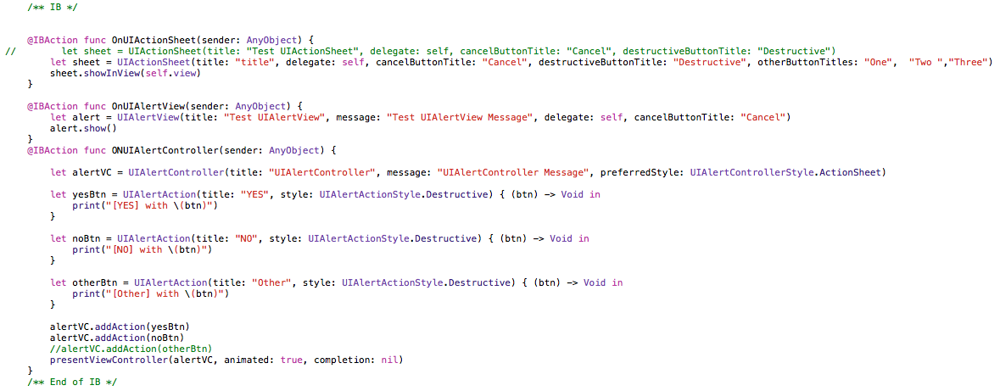
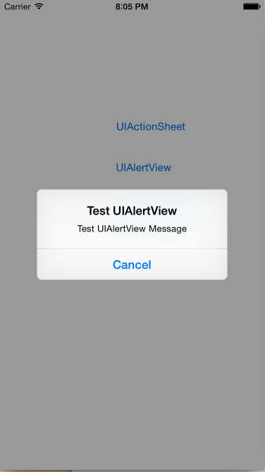

#弹出你的心声

前面我有介绍“大众脸的App”,主要是讲App的外形框架。有了这样的外形框架后，便可以进行内容的填充了，而在制作内容的时候，一个常用的工具就是弹出一个提示框
。一方面可以展示一些调试信息。同时在应用中，弹框也是一个常用的控件。

弹框的功能在iOS8之后，API层面有一个比较大的改变。iOS8之前的弹框是分为两种类型，一种是从屏幕底端衍生上来的（UIActionSheet），另一种是出现在屏幕
中间的（UIAlertView）。在iOS8之后将二者统一为统一对象（UIAlertController），通过其构造函数中的style参数控制其表现（从底部出现或者从中间出现）,同时去掉了前两者繁杂的回调，统一为一个Block(OC)/Closure（Swift）来控制按钮触发后的回调动作。

那么现在问题来了，二者该用哪一个？如果要作产品的话，目前的情况iOS7一般都在兼容范围之内。所以需要选择以前的方式，未来iOS9发布后，根据情况切换到新的
方式上来。

为了演示这三者的效果，我们用Storyboard创建了一个带有三个按钮的界面。每个按钮弹出一个效果。这里贴出“@IBAction”连接后的代码：

##一、iOS8以前的UIActionSheet
UIActionSheet是一个从屏幕底部延伸上来的弹框，效果图如下：

这里对应到的代码只有两行。主要就是创建一个UIActionSheet对象，并调用其`showInView（:）`方法。在构造函数里面指定了弹框的title、message、按钮的title以及代理。其构造函数：

    init(title: String?, delegate: UIActionSheetDelegate?, cancelButtonTitle: String?, destructiveButtonTitle: String?)
    init(title: String?, delegate: UIActionSheetDelegate?, cancelButtonTitle: String?, destructiveButtonTitle: String?, otherButtonTitles firstButtonTitle: String, _ moreButtonTitles: String...)
    
这两个构造函数的区别在于后者可以添加多个按钮，从上而下依次进行排列,注意：最上面的是destructiveButton，最下面的一个是cancelButton，中间的从上到下依次排列。当按钮别点击时，通过delegate来捕获相应的事件，这些回调中一般会带有一个index，通过这个index来判断哪个按钮被点击了。按钮的index规则是：cancelButton为0，destructiveButton为1，其余的从上而下依次递增，比如这里的One-> 2 ，Two->3。

Delegate定义如下：

	// Called when a button is clicked. The view will be automatically dismissed after this call returns
    optional func actionSheet(actionSheet: UIActionSheet, clickedButtonAtIndex buttonIndex: Int)
    
    // Called when we cancel a view (eg. the user clicks the Home button). This is not called when the user clicks the cancel button.
    // If not defined in the delegate, we simulate a click in the cancel button
    optional func actionSheetCancel(actionSheet: UIActionSheet)
    
    optional func willPresentActionSheet(actionSheet: UIActionSheet) // before animation and showing view
    optional func didPresentActionSheet(actionSheet: UIActionSheet) // after animation
    
    optional func actionSheet(actionSheet: UIActionSheet, willDismissWithButtonIndex buttonIndex: Int) // before animation and hiding view
    optional func actionSheet(actionSheet: UIActionSheet, didDismissWithButtonIndex buttonIndex: Int) // after animation

上面的delegate分为四类：
* 第一类是将要显示`willPresentActionSheet`和显示结束`didPresentActionSheet`时。
* 第二类是当点击是触发`actionSheet(actionSheet: UIActionSheet, clickedButtonAtIndex buttonIndex: Int)`
* 第三类是点击后将要消失`actionSheet(actionSheet: UIActionSheet, willDismissWithButtonIndex buttonIndex: Int)`和消失后`actionSheet(actionSheet: UIActionSheet, didDismissWithButtonIndex buttonIndex: Int)`
* 第四类是点击“Home”键后取消界面（注意不是点击Cancel,并且在iOS8后，点Home不会触发）`actionSheetCancel`

这里一次正常点击动作，顺序是“第一类” -> "第二类" -> "第三类"。在点击的回调中有buttonIndex来表示其是哪个按钮被触发。通常只要实现该回调即可。

##二、iOS8以前的UIAlertView
UIAlertView是显示在屏幕中间的弹框，效果如下：

这里也就对应两行代码，创建一个UIAlertView对象，然后调用其`show`方法。同样在构造函数里面指定title、message、按钮的title以及代理。看构造函数：

	
	
Delegate定义如下：

    // Called when a button is clicked. The view will be automatically dismissed after this call returns
    optional func alertView(alertView: UIAlertView, clickedButtonAtIndex buttonIndex: Int)
    
    // Called when we cancel a view (eg. the user clicks the Home button). This is not called when the user clicks the cancel button.
    // If not defined in the delegate, we simulate a click in the cancel button
    optional func alertViewCancel(alertView: UIAlertView)
    
    optional func willPresentAlertView(alertView: UIAlertView) // before animation and showing view
    optional func didPresentAlertView(alertView: UIAlertView) // after animation
    
    optional func alertView(alertView: UIAlertView, willDismissWithButtonIndex buttonIndex: Int) // before animation and hiding view
    optional func alertView(alertView: UIAlertView, didDismissWithButtonIndex buttonIndex: Int) // after animation
    
    // Called after edits in any of the default fields added by the style
    optional func alertViewShouldEnableFirstOtherButton(alertView: UIAlertView) -> Bool

##三、iOS8以后的UIAlertController