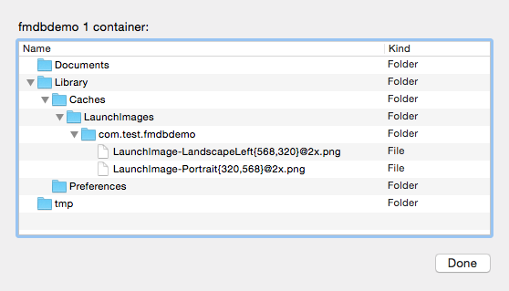

#访问沙箱DataContainer中的文件
在开发iOS应用时，不可避免的需要对文件进行读写操作，比如配置文件存储、log文件存储、SQLite3数据文件等。那么那些位置是可以访问的呢？在后台程序中，我们可以通过登录用户结合文件的权限来进行控制，在iOS中是如何进行控制的呢？iOS通过沙箱（Sandbox）的机制将每个应用控制在一个沙箱中，从而控制每个应用可以访问的位置，一般情况下，应用只能访问自己应用沙箱中的文件，除此之外可以可以访问其他应用沙箱中特定的文件，比如下载了pdf文件，选择用Adobe Reader来打开。

## 一、应用的沙箱目录结构
在iOS中，每个App都相当于一个孤岛，互相之间的数据不可访问，从而防止数据被修改，每个App有一个自己的目录结构或者叫沙箱目录结构：

一个沙箱中包含多个Container，如：

* Bundle Container 主要存放了应用的app文件
* Data Container   主要存放数据文件，也就是我们这里讨论的位置
* iCloud Container iCloud相关的云存储位置

这里我们主要看Data Container用来存储数据的Container。当一个IPA安装后，会在我们的手机里面生成一个目录树。这个目录树可以在模拟中看到,这个目录在“Users/[Your Account]/Library/Developer/CoreSimulator/Devices/[1489AB88-64D7-42DF-A854-BE73566F47D1]/data/Containers/Data/Application/[AA38006C-446F-4B15-ABB4-0DBA90348BC7]” 这里有三个位置用“[]”扩起来了，其是根据不同机器不同的，第一个是用户名，后两个从路径上就可以猜测出来，分别对应一个模拟器设备以及在这个设备中特定的App。该目录结构如下：

这个是一个默认“Signal View”模板的App，没有其他自定义操作，可见其目录的基本结构包含Documents、Library以及tmp目录。

这个结构出来在模拟器中可以看到，在XCode的Devices里面也可以看到手机上以及安装的应用的目录结构:

通过点击XCode的Windos->Devices,然后选中设备，在选中对应的App，双击或者点击“Setting”按钮，便可以看到其“Container”中的内容，甚至下载到本地后打开目录。
	

## 二、目录的常见用途

上面可以看到每个App的Data Container中分为三个基本的目录“Documents”、“Library”以及“tmp”。而“Library”目录下又有“Library/Caches”、“Library/Preferences”目录。虽然整个“Data Container”，App都是可以进行访问的，但是iOS还是做了一些规定，具体可以参见Developer上面关于文件系统的指南[File System Programming Guide](https://developer.apple.com/library/ios/documentation/FileManagement/Conceptual/FileSystemProgrammingGuide/FileSystemOverview/FileSystemOverview.html#//apple_ref/doc/uid/TP40010672-CH2-SW2) 

一般的App通常操作这样几个目录：

目录| 作用 | 是否会被iTunes同步
---|---|---
Documents|用来保存App生成的内容，比如地图App下载的地图数据、SQLite3的DB数据等 | 是
Documents/Inbox | 这个就是一个特殊的目录，这里的文件，可以被系统中注册了打开对应文件类型的App访问，比如浏览器下载的pdf放在这个目录中，可以请求Adobe Reader进行访问，其实质也不是让其他应用直接访问，而是将里面的内容copy一份到其他应用（这里的Adobe Reader）的对应的目录中| 是
Library| 一些对App用户透明的数据，比如缓存数据、状态记录文件 | 是（Library/Caches不同步）
Library/Preferences| App的设置文件，如plist配置等 | 是
Library/Caches| App运行中的缓存文件 | 否
tmp| 临时文件，App再次起来后，不需要的文件如日志，改目录下的文件当磁盘空间不足时，可能被系统删除，所以使用时需注意|否

知道了这些目录的使用“潜规则”后，就可以通过API获得这些目录并进行访问了。iOS自己提供了一套API来获得对应的路径，定义在Foundation中：

	    print("Home Path: \(NSHomeDirectory()) \n")
        print("Documents Path:\(NSSearchPathForDirectoriesInDomains(NSSearchPathDirectory.DocumentDirectory, NSSearchPathDomainMask.AllDomainsMask, true)) \n")
        print("Library Path:\(NSSearchPathForDirectoriesInDomains(NSSearchPathDirectory.LibraryDirectory, NSSearchPathDomainMask.UserDomainMask, true)) \n")
        print("Caches Path:\(NSSearchPathForDirectoriesInDomains(NSSearchPathDirectory.CachesDirectory, NSSearchPathDomainMask.AllDomainsMask, true))\n")
        print("Download Path:\(NSSearchPathForDirectoriesInDomains(NSSearchPathDirectory.DownloadsDirectory, NSSearchPathDomainMask.AllDomainsMask, true))\n")
        print("tmp Path:\(NSTemporaryDirectory()) \n")
        
得到的输出为：

	Home Path: /var/mobile/Containers/Data/Application/2E89B5B0-0B8F-45AA-88BA-A6F4A9B15289 
	Documents Path:[/var/mobile/Containers/Data/Application/2E89B5B0-0B8F-45AA-88BA-A6F4A9B15289/Documents] 
	Library Path:[/var/mobile/Containers/Data/Application/2E89B5B0-0B8F-45AA-88BA-A6F4A9B15289/Library] 
	Caches Path:[/var/mobile/Containers/Data/Application/2E89B5B0-0B8F-45AA-88BA-A6F4A9B15289/Library/Caches, /Library/Caches, /System/Library/Caches]
	Download Path:[/var/mobile/Containers/Data/Application/2E89B5B0-0B8F-45AA-88BA-A6F4A9B15289/Downloads]
	tmp Path:/private/var/mobile/Containers/Data/Application/2E89B5B0-0B8F-45AA-88BA-A6F4A9B15289/tmp/ 
        
这里通过print打印出来上面讨论的几种目录，其中"Home"目录也就是沙箱的地址，通过`NSHomeDirectory()`获取，"tmp"目录通过`NSTemporaryDirectory()`获取，其他目录通过函数：

	func NSSearchPathForDirectoriesInDomains(directory: NSSearchPathDirectory, domainMask: NSSearchPathDomainMask, expandTilde: Bool) -> [AnyObject]!
	
获取，这里主要通过枚举来控制获得什么路径，expandTiled表示是否将路径中“~”扩展成全路径，也就是是否扩展home目录，这个做后台的应该很熟悉。该函数一般返回一个路径的list，所以需要通过NSSearchPathDirectory指定获取什么路径，通过NSSearchPathDomainMask指定哪个范围的路径，比如我们后台说的lib目录一般有"/lib"、“/usr/lib”、"./"等。

NSSearchPathDirectory是一个枚举值，主要控制获取什么的路径，比如上面我们可以获得下载路径的地址。主要意义有：

	 case ApplicationDirectory // supported applications (Applications)
	 case DemoApplicationDirectory // unsupported applications, demonstration versions (Demos)
	 case DeveloperApplicationDirectory // developer applications (Developer/Applications). DEPRECATED - there is no one single Developer directory.
	 case AdminApplicationDirectory // system and network administration applications (Administration)
	 case LibraryDirectory // various documentation, support, and configuration files, resources (Library)
	 case DeveloperDirectory // developer resources (Developer) DEPRECATED - there is no one single Developer directory.
	 case UserDirectory // user home directories (Users)
	 case DocumentationDirectory // documentation (Documentation)
	 case DocumentDirectory // documents (Documents)
	 case CoreServiceDirectory // location of CoreServices directory (System/Library/CoreServices)
	 @availability(iOS, introduced=4.0)
	 case AutosavedInformationDirectory // location of autosaved documents (Documents/Autosaved)
	 case DesktopDirectory // location of user's desktop
	 case CachesDirectory // location of discardable cache files (Library/Caches)
	 case ApplicationSupportDirectory // location of application support files (plug-ins, etc) (Library/Application Support)
	 @availability(iOS, introduced=2.0)
	 case DownloadsDirectory // location of the user's "Downloads" directory
	 @availability(iOS, introduced=4.0)
	 case InputMethodsDirectory // input methods (Library/Input Methods)
	 @availability(iOS, introduced=4.0)
	 case MoviesDirectory // location of user's Movies directory (~/Movies)
	 @availability(iOS, introduced=4.0)
	 case MusicDirectory // location of user's Music directory (~/Music)
	 @availability(iOS, introduced=4.0)
	 case PicturesDirectory // location of user's Pictures directory (~/Pictures)
	 @availability(iOS, introduced=4.0)
	 case PrinterDescriptionDirectory // location of system's PPDs directory (Library/Printers/PPDs)
	 @availability(iOS, introduced=4.0)
	 case SharedPublicDirectory // location of user's Public sharing directory (~/Public)
	 @availability(iOS, introduced=4.0)
	 case PreferencePanesDirectory // location of the PreferencePanes directory for use with System Preferences (Library/PreferencePanes)
	 // location of the user scripts folder for the calling application (~/Library/Application Scripts/code-signing-id)
	 @availability(iOS, introduced=4.0)
	 case ItemReplacementDirectory // For use with NSFileManager's URLForDirectory:inDomain:appropriateForURL:create:error:
	 case AllApplicationsDirectory // all directories where applications can occur
	 case AllLibrariesDirectory // all directories where resources can occur

NSSearchPathDomainMask也是一个枚举值，主要控制获取的范围：

    static var UserDomainMask: NSSearchPathDomainMask { get } // user's home directory --- place to install user's personal items (~)
    static var LocalDomainMask: NSSearchPathDomainMask { get } // local to the current machine --- place to install items available to everyone on this machine (/Library)
    static var NetworkDomainMask: NSSearchPathDomainMask { get } // publically available location in the local area network --- place to install items available on the network (/Network)
    static var SystemDomainMask: NSSearchPathDomainMask { get } // provided by Apple, unmodifiable (/System)
    static var AllDomainsMask: NSSearchPathDomainMask { get } // all domains: all of the above and future items
    
比如上面获取Library目录时，选择了UserDomainMask，而不是AllDomainsMask。这样得到的目录里面就不包括系统目录"[/Library, /Network/Library, /System/Library]”了。