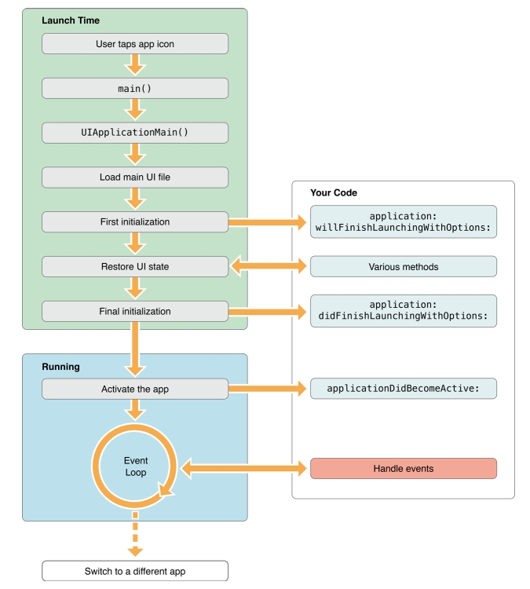
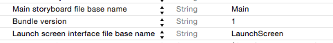

#Swift App中的Main Loop
在写后台代码的时候，一个服务进程一般是由一个MainLoop来控制整个逻辑的生命周期，由网络、定时器或者其他事件驱动逻辑。这里才是逻辑真正意义上的main。那么在一个Swift的工程中，哪里才是MainLoop或者叫main，哪里才是入口点呢？

##一、Swift工程目录
如何创建一个iOS工程，这里就不赘述了，找下“三天学会iOS”那种系列的书或者教程（PS:傻瓜教程问百度，进阶教程问Google）。这里我们创建一个SingalView的工程。首先我们看到工程目录的结构以及其对应的物理结构：
 

 

这里左边的工程目录结构是XCode进行组织的。应用的逻辑主要在工程Group下面，也就是这里的bootup。“bootupTests”是XCTest单元测试的工程，这里我们可以不关心他。“Products”是最终Target编译出来的产品。在回过头来看“botup”Group,这里主要包含了：
* *.swift :swift的源码文件，主要的逻辑代码
* Main.storyboard : storyboard文件，从iOS5之后开始增加的UI描述文件，可以在IB里面进行可视化修改，主要是代替以前的Nib(Xib)文件
* Images.xcassets : assets资源文件，主要存放应用Icon等资源
* LaunchScreen.xib: 启动时的launch界面的UI描述文件，就是传统的Nib文件
* Supportting Files:一个虚拟的组，主要存放了配置文件info.plist。

对应到物理结构，我们看到出来工程文件bootup.xcodeproj和测试工程“bootupTests”目录之外就是主要的工程代码目录"bootup"。这里
* Base.Iproj：存放了工程的UI描述文件，也就是上面的storyborad和Nib文件
* Images.xcassets:存放了图片相关的资源
* info.plist: 配置文件
* *.swift:上面说的swift源码文件

可以看到这里的工程目录和物理目录是不一致的。只要在工程目录中引入的swift文件都会被编译进入到App中。

在Swift中，代码的可见性主要划分成两个概念，Module和File。这里Module指的是一个完整的App或者一个Framwork。所以上面在组织代码的时候，只需要将代码加入工程即可。

##二、MainLoop入口
上面的工程目录中，我们看到，代码文件主要就两个swift文件，其中将ViewController.swift干掉，程序也是可以起来的，可见该文件并不是MainLoop的组成部分，否则App应该无法运行。那剩下的就只有AppDelegate.swift文件了。点开这个文件，我们可以看到其继承了`UIApplicationDelegate`，并且还有个`@UIApplicationMain`

	@UIApplicationMain
	class AppDelegate: UIResponder, UIApplicationDelegate {
在OC的时代，在SupportFiles的Group里面还有个"main.m"的文件，里面有个main函数并在这个函数中指定了UIApplicationMain：
	
	int main(int argc, char * argv[]) {
	    @autoreleasepool {
	        return UIApplicationMain(argc, argv, nil, NSStringFromClass([AppDelegate class]));
	    }
	}
在Swift中，就是通过上面的`@UIApplicationMain`来指定主应用的Delegate，从而达到和OC里面显示指定类似的效果。这里用OC做对比是这样对于C-Like背景的同学更容易理解。

那这个UIApplicationMain到底是个啥呢？我们来看下iOS官方的[]App Life Cycle](https://developer.apple.com/library/ios/documentation/iPhone/Conceptual/iPhoneOSProgrammingGuide/TheAppLifeCycle/TheAppLifeCycle.html)。首先看一个iOSApp里面的关键的对象图：

在这个图中可以看到一个标准的MVC结构。Moduleh和View可以不管他，那个是我们应用中要去实现的部分。这里看下Controller部分。这里有一个“EventLoop”从颜色也可以可到这个是一个系统对象，也就是iOS为我们提供的结构，不用关心他的实现，这里从名称也可以看到，我们已经找到了我们的目标“MainLoop”，那么我们如何在这个loop中打桩插入我们的逻辑呢？这里从图中可以看到EventLoop中有个“UIApplication“，他还有个“Application Delegate”，在这个EventLoop中当遇到相关的事件，比如触屏、后台挂起，程序加载完成，就会通过这个Delegate来执行其实现中的逻辑，就相当于在MainLoop里面有个桩一样。

这里的EventLoop为什么叫“Event”呢？其实和我们一个“事件驱动的异步网络库”一样，主循环中的业务逻辑一般都是由网络IO、定时器、信号或者其他事件来触发的。那么对于iOS App我们可以看下下面这个图：

从图中可以讲用户触屏认为是一个IO事件，然后通知到上面的EventLoop，然后再loop中Delegate到业务逻辑中的其他对象，最后通过系统对象表现出来。

这样整个流程就和一个后台程序的MainLoop是类似的了，这里的UIApplicationMain就是我们进入iOS App MainLoop的大门。
	

##三、Application Delegate
上面通过	@UIApplicationMain指定了MainLoop中桩的位置。那么这个桩被钉在哪些位置呢？ 这个我可以从其实现的protocol来循迹。在
代码文件中Ctrl+点击`UIApplicationDelegate`可以看到其定义：

	 protocol UIApplicationDelegate : NSObjectProtocol {
	 	...
	 }
	 
由于内容过多这里就不贴出来了。在XCode为我们生成的模板文件中，接口倒不是很多，而且这些已经可以让一个完整的app run起来了，因此我们可以从这些接口看起：

    func application(application: UIApplication, didFinishLaunchingWithOptions launchOptions: [NSObject: AnyObject]?) -> Bool {
        // Override point for customization after application launch.
        return true
    }

    func applicationWillResignActive(application: UIApplication) {
        // Sent when the application is about to move from active to inactive state. This can occur for certain types of temporary interruptions (such as an incoming phone call or SMS message) or when the user quits the application and it begins the transition to the background state.
        // Use this method to pause ongoing tasks, disable timers, and throttle down OpenGL ES frame rates. Games should use this method to pause the game.
    }

    func applicationDidEnterBackground(application: UIApplication) {
        // Use this method to release shared resources, save user data, invalidate timers, and store enough application state information to restore your application to its current state in case it is terminated later.
        // If your application supports background execution, this method is called instead of applicationWillTerminate: when the user quits.
    }

    func applicationWillEnterForeground(application: UIApplication) {
        // Called as part of the transition from the background to the inactive state; here you can undo many of the changes made on entering the background.
    }

    func applicationDidBecomeActive(application: UIApplication) {
        // Restart any tasks that were paused (or not yet started) while the application was inactive. If the application was previously in the background, optionally refresh the user interface.
    }

    func applicationWillTerminate(application: UIApplication) {
        // Called when the application is about to terminate. Save data if appropriate. See also applicationDidEnterBackground:.
    }

通过注释我们可以看到每个接口大概的意思。这里比较常定制的就是这个application 第一个接口。其在iOS程序完成基本的初始化话并展示了Launch界面之后显示主界面之前的时刻。可以参考iOS官方的launch生命周期图。这个是OC的接口，对应Swift按照《Using Swift with Cocoa and Objective-C》里面的对应规则。这里用Siwft的接口中参数名的"place name"进行连接，可以和OC的接口对上：

这里的的MainUIfile是在plist里面进行设置的，也就是我们之前看到的那个Main.storyboard，同时这里应该还包括了Launch界面的UI文件。也是在plist文件中修改的。
 

也可以在工程界面中进行设置。

在这之后就会进入到UI显示的过程了。iOS的应用一般都是由一个window来组织UI的。可以参考[Apple的文档](https://developer.apple.com/library/ios/documentation/WindowsViews/Conceptual/WindowAndScreenGuide/WindowScreenRolesinApp/WindowScreenRolesinApp.html)。一个window就可以认为他是iPhone的屏幕。
这里我们看到的XCode为我们生成的模板里面就有一个windowd成员：

    var window: UIWindow?
    
window是不能直接控制显示层的View的，因此需要为window设置一个rootViewController。但是我们发现这里不做任何设置，确实可以显示我们Main.storyboard里面的UI的。因此猜想这里可能将其设置成默认的值。并且这个Main.storybord中指定了其UIViewController的类，也被它一并初始化了。我们可以做个试验。在上面的接口中的`return true `的前面增加一句

	self.window?.rootViewController  = nil
	
在运行就会看到显示空白了（黑色屏幕表示啥也没有）

如果此时在ViewController.swift中的`viewDidLoad`里面打断点，会发现也不起作用。由此可见，如果不想用Storyboard以及其他Nib文件的话，可以从这里设置rootViewController开始。
