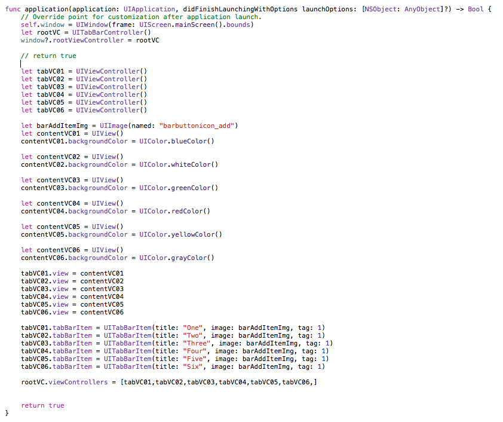
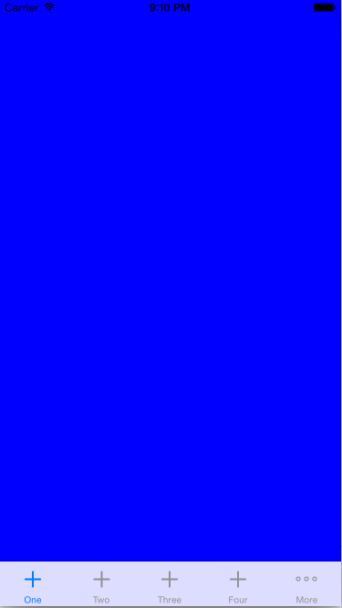

#另一张TabBar大众脸的App
前面我们通过Navigation创建了一种可以切换界面外壳的App，其实拿起iPhone，我们发现除了这种类型还有另一种类型外壳的App.如下图：

 

我们发现这类App都是在最下面有一排Tab，每个Tab的Item表示一个分类的界面，通过点击这些Tab可以切换到对应的界面中。再回想下QQ/微信、
淘宝/天猫、微博等每天都要用的App。

发现了什么？？？这些App都是这样的一个基本外壳。是不是把这个学会了，就是做牛逼哄哄的App了？

## 一、TabBar是神马
在Developer上的文章[《View Controller Catalog for iOS》](https://developer.apple.com/library/ios/documentation/WindowsViews/Conceptual/ViewControllerCatalog/Chapters/TabBarControllers.html#//apple_ref/doc/uid/TP40011313-CH3-SW1) 中对TabBar的定义为：
>  It is composed of views that the tab bar controller manages directly and views that are managed by content view controllers you provide. Each content view controller manages a distinct view hierarchy, and the tab bar controller coordinates the navigation between the view hierarchies.

说白了就是一个管理其他用于承载实际内容的ViewController的容器ViewController,并且可以通过TabBar进行UI上的导航，也就是上面我们举例App的操作效果。

我们来看下其组成结构图：

主要就是由下面的一个TabBar的list和承载显示内容的TabBarControllerView组成，每个TabBar还可以设置一个小的标题title和一个图标。
并且每个图标上面还可以显示一个红点（想想微信里面有新消息的时候）来表示一些提示信息。因此我们可以猜想，其实现就是用一个数组来保存每个
界面的ViewController，然后绘制一个可触发的Tab，当点击的时候切换到对应的ViewController中。 这样我们再看官方的分解图就容易理解了:

## 二、通过Tab切换界面

这里我手写一个界面：

这里创建一个 `UITabBarController`对象`rootVC`作为window的rootviewcontroller。如果就这样的话（打开这里的return 的注释），那么我们可以看到运行结果中就是在下面有个tab站位区间的界面。

这时我们再创建几个容器ViewController，并为其创建一个一个带有背景颜色的View，从而方便鉴别。最后将这些容器ViewController赋给上面我们说的数组中：

	rootVC.viewControllers = [tabVC01,tabVC02,tabVC03,tabVC04,tabVC05,tabVC06,]
	
可以看到我们的运行效果：

## 三、设置单个界面

## 四、中间发生了神马
