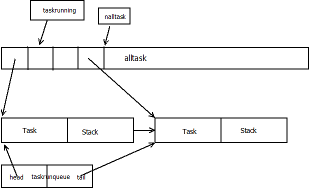

# Libtask 中的数据结构
通过前面的文章[Libtask实现的协程]()我们大致了解了libtask是怎么组织任务以及怎么实现调度的。由于libtask是一个实验产品或者说是一个学习示例，其代码相对简洁，并且用了大量全局变量来保存整个库的状态。同时为了管理任务，还需要使用一些数据结构来组织。另外litbask实现的协程通讯机制“Channel”是怎样组织的。这里我们在来看Libtask组织的数据结构。

##一、全局变量
在task.c文件中有这么一些变量的定义：

    int	taskcount;  // task 的计数器
    int	tasknswitch; // 统计的切换次数
    int	taskexitval;
    Task	*taskrunning; // 当前运行中的task
    
    Context	taskschedcontext;  // schedule时候的缓存context
    Tasklist	taskrunqueue;  // 一个task的单链表
    
    Task	**alltask;// 管理task的task池
    int		nalltask; // task长度
    
1. 在前面的文中也看到了这几个变量。其中taskcount记录了当前系统中有多少个任务，通过该计数器控制主循环的退出时机。
2. tasknswitch该变量统计了当前系统切换上下文的次数。在yield函数中通过用新的tasknswitch减去老的tasknswitch从而计算出还有多少个task在调度中。

    return tasknswitch - n - 1;
3. taskexitval在最后调用系统exit的时候传入该值，实际上就是统一的错误码存储位置
4. taskrunning记录了当前运行的task
5. taskschedcontext用作在schedule记录for上下文的缓冲区
6. taskrunqueue一个单链表。带有head和tail成员。记录了所有等待调度的任务。从其命名可以看出其是按照queue来组织的。因此任务的调度是：*执行过的任务，再次yield的时候是inqueue操作的，也就是从队列尾部加入，依次等待被调度。
7. alltask是一个Task地址的动态数组，有个初始大小64，每次不够时按照64进行增加。
8. nalltask是上面alltask数组的长度。

整个的内存结构大概是这样的:

##二、Task结构

