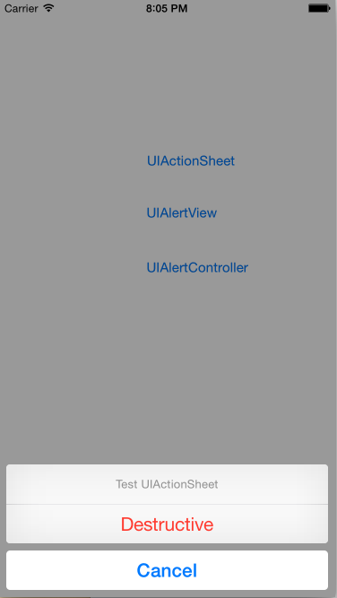
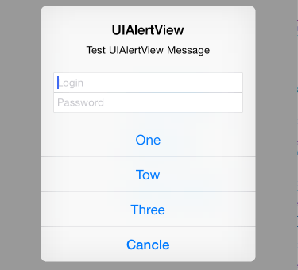

#弹出你的心声

前面我有介绍“大众脸的App”,主要是讲App的外形框架。有了这样的外形框架后，便可以进行内容的填充了，而在制作内容的时候，一个常用的工具就是弹出一个提示框
。一方面可以展示一些调试信息。同时在应用中，弹框也是一个常用的控件。

弹框的功能在iOS8之后，API层面有一个比较大的改变。iOS8之前的弹框是分为两种类型，一种是从屏幕底端衍生上来的（UIActionSheet），另一种是出现在屏幕
中间的（UIAlertView）。在iOS8之后将二者统一为统一对象（UIAlertController），通过其构造函数中的style参数控制其表现（从底部出现或者从中间出现）,同时去掉了前两者繁杂的回调，统一为一个Block(OC)/Closure（Swift）来控制按钮触发后的回调动作。

那么现在问题来了，二者该用哪一个？如果要作产品的话，目前的情况iOS7一般都在兼容范围之内。所以需要选择以前的方式，未来iOS9发布后，根据情况切换到新的
方式上来。

为了演示这三者的效果，我们用Storyboard创建了一个带有三个按钮的界面。每个按钮弹出一个效果。这里贴出“@IBAction”连接后的代码：

##一、iOS8以前的UIActionSheet
UIActionSheet是一个从屏幕底部延伸上来的弹框，效果图如下：

这里对应到的代码只有两行。主要就是创建一个UIActionSheet对象，并调用其`showInView（:）`方法。在构造函数里面指定了弹框的title、message、按钮的title以及代理。其构造函数：

    init(title: String?, delegate: UIActionSheetDelegate?, cancelButtonTitle: String?, destructiveButtonTitle: String?)
    init(title: String?, delegate: UIActionSheetDelegate?, cancelButtonTitle: String?, destructiveButtonTitle: String?, otherButtonTitles firstButtonTitle: String, _ moreButtonTitles: String...)
    
这两个构造函数的区别在于后者可以添加多个按钮，从上而下依次进行排列,注意：最上面的是destructiveButton，最下面的一个是cancelButton，中间的从上到下依次排列。当按钮别点击时，通过delegate来捕获相应的事件，这些回调中一般会带有一个index，通过这个index来判断哪个按钮被点击了。按钮的index规则是：cancelButton为0，destructiveButton为1，其余的从上而下依次递增，比如这里的One-> 2 ，Two->3。

Delegate定义如下：

	// Called when a button is clicked. The view will be automatically dismissed after this call returns
    optional func actionSheet(actionSheet: UIActionSheet, clickedButtonAtIndex buttonIndex: Int)
    
    // Called when we cancel a view (eg. the user clicks the Home button). This is not called when the user clicks the cancel button.
    // If not defined in the delegate, we simulate a click in the cancel button
    optional func actionSheetCancel(actionSheet: UIActionSheet)
    
    optional func willPresentActionSheet(actionSheet: UIActionSheet) // before animation and showing view
    optional func didPresentActionSheet(actionSheet: UIActionSheet) // after animation
    
    optional func actionSheet(actionSheet: UIActionSheet, willDismissWithButtonIndex buttonIndex: Int) // before animation and hiding view
    optional func actionSheet(actionSheet: UIActionSheet, didDismissWithButtonIndex buttonIndex: Int) // after animation

上面的delegate分为四类：
* 第一类是将要显示`willPresentActionSheet`和显示结束`didPresentActionSheet`时。
* 第二类是当点击是触发`actionSheet(actionSheet: UIActionSheet, clickedButtonAtIndex buttonIndex: Int)`
* 第三类是点击后将要消失`actionSheet(actionSheet: UIActionSheet, willDismissWithButtonIndex buttonIndex: Int)`和消失后`actionSheet(actionSheet: UIActionSheet, didDismissWithButtonIndex buttonIndex: Int)`
* 第四类是点击“Home”键后取消界面（注意不是点击Cancel,并且在iOS8后，点Home不会触发）`actionSheetCancel`

这里一次正常点击动作，顺序是“第一类” -> "第二类" -> "第三类"。在点击的回调中有buttonIndex来表示其是哪个按钮被触发。通常只要实现该回调即可。

##二、iOS8以前的UIAlertView
UIAlertView是显示在屏幕中间的弹框，效果如下：

这里也就对应两行代码，创建一个UIAlertView对象，然后调用其`show`方法。同样在构造函数里面指定title、message、按钮的title以及代理。看构造函数：

	init(title: String?, message: String?, delegate: AnyObject?, cancelButtonTitle: String?) /*<UIAlertViewDelegate>*/
	init(title: String, message: String, delegate: UIAlertViewDelegate?, cancelButtonTitle: String?, otherButtonTitles firstButtonTitle: String, _ moreButtonTitles: String...)
	
这里可以看到和上面的构造函数是非常类似的，主要就是在构造函数里面指定了titile以及message信息。同时可以选择增加多个按钮。这里其触发回调的规则和
上面的UIActionSheet的规则一样，通过一个index来表示，这里的cancelButton为0，其他的按照出现顺序依次递增。对于只有两个按钮时，是横着排列，当
多余三个（含）是垂直排列。
	
Delegate定义如下：

    // Called when a button is clicked. The view will be automatically dismissed after this call returns
    optional func alertView(alertView: UIAlertView, clickedButtonAtIndex buttonIndex: Int)
    
    // Called when we cancel a view (eg. the user clicks the Home button). This is not called when the user clicks the cancel button.
    // If not defined in the delegate, we simulate a click in the cancel button
    optional func alertViewCancel(alertView: UIAlertView)
    
    optional func willPresentAlertView(alertView: UIAlertView) // before animation and showing view
    optional func didPresentAlertView(alertView: UIAlertView) // after animation
    
    optional func alertView(alertView: UIAlertView, willDismissWithButtonIndex buttonIndex: Int) // before animation and hiding view
    optional func alertView(alertView: UIAlertView, didDismissWithButtonIndex buttonIndex: Int) // after animation
    
    // Called after edits in any of the default fields added by the style
    optional func alertViewShouldEnableFirstOtherButton(alertView: UIAlertView) -> Bool

这里会发现和UIActionSheet的回调基本一致：
* 显示前后的`willPresentAlertView`和`didPresentAlertView`
* 点击时的`alertView(alertView: UIAlertView, clickedButtonAtIndex buttonIndex: Int)`
* 消失时的`alertView(alertView: UIAlertView, willDismissWithButtonIndex buttonIndex: Int)`和`alertView(alertView: UIAlertView, didDismissWithButtonIndex buttonIndex: Int)`

这里发现有个多的 `alertViewShouldEnableFirstOtherButton` Developer上面的说明是:
> Sent to the delegate to determine whether the first non-cancel button in the alert should be enabled.

但是我构建了几个场景，都没有触发这个回调。

UIAlertView除了可以弹出按钮以外，还可以弹出带有输入框的弹窗。但是iOS8以前的弹窗比较受限，这里只能通过几个枚举值来设置一个/两个输入框，并且提示
字符都已经被设置：

	enum UIAlertViewStyle : Int {
    
	    case Default
	    case SecureTextInput
	    case PlainTextInput
	    case LoginAndPasswordInput
	}
	
通过设置UIAlertView的alertViewStyle属性为上面的枚举，可以实现一个输入框/两个输入框的界面。

    

##三、iOS8以后的UIAlertController

从iOS8以后，Apple废除了上面两个接口（当然也是还可以用的），将其统一为一个UIAlertController对象来管理，通过一个style属性来控制其表象上面两个
控件的效果。并简化了回调，转而用Block/Closure控制按键后的动作，从而简化使用过程。在上面的代码中我们看使用方法就是先创建一个UIAlertController
一个对象，然后设置其title和message属性，并给定一个type：

	enum UIAlertControllerStyle : Int {
	    case ActionSheet   // 和UIActionSheet类似的效果，从屏幕的下方延伸出来
	    case Alert         // 和UIAlertView类似效果，在屏幕中间显示
	}
	
这里UIAlertController没有再默认定义cancelButton和destructiveButton了。而所有的Button均需要调用`AddAction(_:)`方法进行增加，这里增加的参数是一个 `UIAlertAction`对象，其在构建时，设置显示的Title，一个style表示cancelButton或者destructiveButton以及其他类型，一个
Block/Closure表示按下后的回调handler动作。先看下UIAlertAction的构造函数：

	init(title: String, style: UIAlertActionStyle, handler: ((UIAlertAction!) -> Void)!)
	
参数就是上面说明三个对象。在调用时，需要注意一个Swift新的语言特性“Trailing Closures”:当函数的最后一个参数是一个Closure的时候，可以将其写在
函数的小括号的外面如：

	someFunctionThatTakesAClosure ({
		// closure's body goes here
	})
	
	// 同等作用
	someFunctionThatTakesAClosure() {
		// closure's body goes here
	}
	
所以我们可以这样定义一个UIAlertAction:

	 let yesBtn = UIAlertAction(title: "YES", style: UIAlertActionStyle.Destructive) { (btn) -> Void in
	    print("[YES] with \(btn)")
	}

这里当按钮被点击时便出发Closure里面的逻辑，同时将这个btn传递了下来，就省去了以前的用index索引的繁琐了。

对于	UIAlertControllerStyle.ActionSheet是不可以增加输入框的，但是对于UIAlertControllerStyle.Alert有一个`addTextFieldWithConfigurationHandler`接口可以添加输入框，类似UIAlertUI里面的UIAlertViewStyle，但是更丰富，可以自定义增加：

	func addTextFieldWithConfigurationHandler(configurationHandler: ((UITextField!) -> Void)!)
	
我们可以这么调用：

	alertVC.addTextFieldWithConfigurationHandler { (txtField) -> Void in
	   txtField.placeholder = "密码"
	}
	
这里添加了一个提示“密码”的输入框，当界面弹出时，便会调用这里的Closure，同时将UITextField传递下来了，这样我们就可以控制其表现，比如这里将
placeholder设置成“密码”。这里可以将UITextField保存下来，在按钮被按后，货期其中的内容。

## Bringe it to all
通过UIAlertController，我们完全可以模拟以前的UIActionSheet和UIAlertView效果，并且自定义程度更高，同时用Closure使用更加方便。但是需要在
iOS8以后才能用，当需要一些高级功能的时候：比如要增加三个输入框。那么可以判断当前平台，然后写两份代码。或者更裸的做法，现在产品中还是用老的方法，待不用兼容iOS7以前时全部切换到新的上面来。
